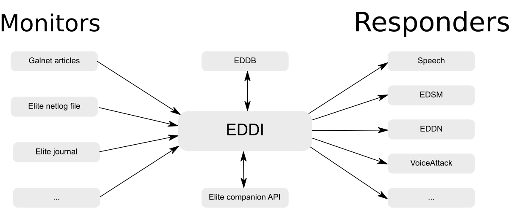

 

# EDDI: The Elite Dangerous Data Interface

EDDI is a companion application for Elite: Dangerous, providing responses to events that occur in-game using data from the game as well as various third-party tools.

EDDI reads data from a variety of sources to provide players with additional information whilst in-game, and also with events that can trigger such things as spoken responses or VoiceAttack actions.  The basic flow of EDDI is shown below:

Monitors are pieces of code that check for information, for example a new Galnet article being published or an entry to Elite's journal.  Monitors pass information on the event to EDDI.

EDDI takes events and carries out operations based on them.  For example, if the event says that the player has changed system then EDDI will fetch updated system information from EDDB.  Once it has gathered all of the required information it will notify each responder of the event.

Responders take the events, along with any information that has been gathered by EDDI, and carry out actions.  For example the EDSM responder sends details of any jumps that the player makes to EDSM so that they have a permanent record of their flight logs, the speech responder provides a spoken response to events, the VoiceAttack responder provides variables to VoiceAttack scripts and runs specific scripts when events occur, etc.

Monitors and responders can be configured from the EDDI UI, and can be individually enabled or disabled as required.

## Installing and Configuring EDDI

EDDI can be installed standalone or as a VoiceAttack plugin.

Download the EDDI installer from [https://github.com/EDCD/EDDI/releases](https://github.com/EDCD/EDDI/releases).  By default it will install in C:\Program Files (x86)\VoiceAttack\Apps\EDDI, which is fine regardless of if you have VoiceAttack or not, but of course you can change it if you wish (although note that if the installation is not in a subdirectory of your VoiceAttack's Apps directory then it will not be able to be used as a VoiceAttack plugin).

Alternatively you can compile EDDI from the sources at [https://github.com/EDCD/EDDI](https://github.com/EDCD/EDDI).

When you start EDDI it will bring up a window with a number of tabs.  Each tab explains its function and how to configure it, so you will be best served to read each tab and set it up according to your liking.

## Using EDDI with VoiceAttack

Initial EDDI integration with VoiceAttack is automatic, but there is a lot that you can do to integrate EDDI with your own VoiceAttack scripts.  Full details of what you can do with EDDI and VoiceAttack are on the [VoiceAttack EDDI page](https://github.com/EDCD/EDDI/wiki/VoiceAttack-Integration).

## Upgrading EDDI

If you are upgrading from EDDI 1 EDDI it is recommended that you uninstall your existing version of EDDI and remove your %APPDATA%\EDDI directory prior to upgrading to the new one.  This ensures that there is a clean installation and reduces the chances of problems occurring.

If you are upgrading from another version of EDDI 2 the installer will take care of changes so you just need to run it.

## EDDI Voices

EDDI uses the standard Windows TTS (text-to-speech) voices.  The voice needs to be visible to Windows' TTS system to be made available to EDDI: this usually takes place when you install the voice.  If you cannot see a voice in EDDI then check the Windows TTS settings.

If you want to have a high-quality voice other than that available with Windows then the best choices are to purchase voices from either Ivona or Cereproc.  Though both provide great voices, Ivona voices typically adhere more closely to published SSML standards and provide fuller functionality for phonetic speech and other advanced features like pauses in the middle of speech and correct pronunciation of names (ships, powers, systems, etc.).

# Troubleshooting

If you are experiencing problems with EDDI then your first port of call should be the [troubleshooting page](https://github.com/EDCD/EDDI/blob/master/TROUBLESHOOTING.md).  If this does not fix your problem then please check the Known issues below:

If you have an issue with EDDI then please [report it](https://github.com/EDCD/EDDI/issues). 

# Uninstalling EDDI

If you want to uninstall EDDI then you can do so through the Windows control panel.  Any data that EDDI creates is stored in the %APPDATA%\EDDI directory, and this can also be removed on uninstall.
