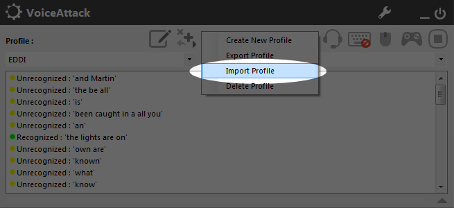
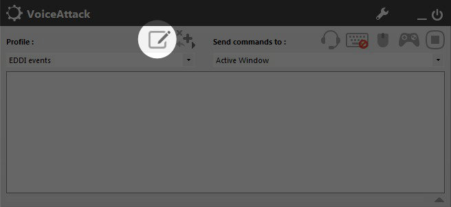
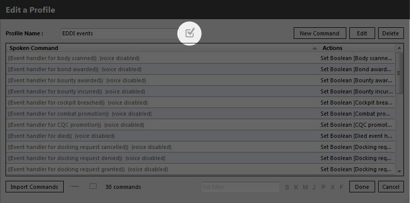
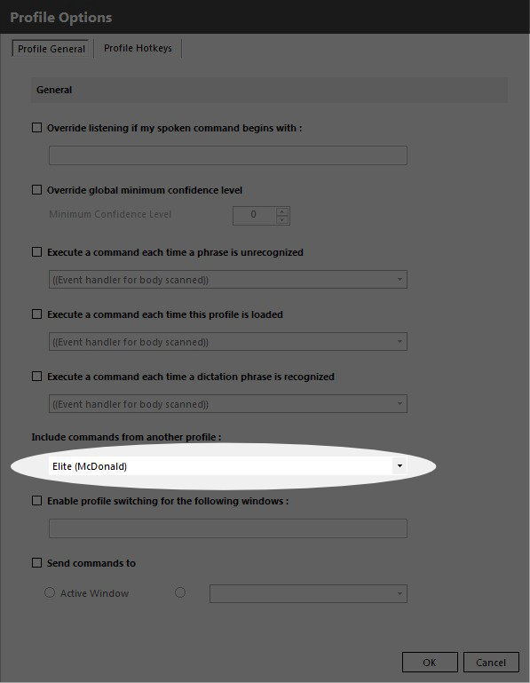

# EDDI: The Elite Dangerous Data Interface

Current version: 2.0.0b1

EDDI is a companion application for Elite: Dangerous, providing responses to events that occur in-game using data from the game as well as various third-party tools.

EDDI responds to a wide range of events, and also provides a VoiceAttack plugin to allow for direct interaction with information made available by EDDI.

##Installing EDDI

EDDI can be installed standalone or as a VoiceAttack plugin.

Download the EDDI ZIP file from [http://www.mcdee.net/elite/EDDI.zip](http://www.mcdee.net/elite/EDDI.zip) or compile it from the sources at [https://github.com/cmdrmcdonald/EliteDangerousDataProvider](https://github.com/cmdrmcdonald/EliteDangerousDataProvider).

###Installing EDDI standalone

If you want to run EDDI standalone then you can unzip the files to the directory of your choice.

###Installing EDDI as a VoiceAttack plugin

If you want to run EDDI as a VoiceAttack plugin then you must unzip the files to the 'Apps' directory within the VoiceAttack program directory (usually installed at c:\Program Files (x86)\VoiceAttack).  The resultant directory structure, assuming the standard directories, should be c:\Program Files (x86)\VoiceAttack\Apps\EDDI.

You must use a suitable version of VoiceAttack for EDDI to operate correctly.  At current the minimum version 1.5.12.  You need to carry out a number of steps to ensure that EDDI will run in VoiceAttack.  First, ensure that plugins are enabled in VoiceAttack.  To do so, first select the configuration button on the main VoiceAttack window:

Then confirm that plugin support is enabled.

Next, you need to import the two EDDI profiles.  To do so click on the profile button and select 'Import Profile':

Navigate to the EDDI installation directory and select the "EDDI events" profile.  Click "OK" to load it.

Repeat the above process for the "EDDI" profile.

###Combining Your Existing Profile With EDDI

If you already have a VoiceAttack profile then you will need to link it to EDDI to ensure that your existing commands are available.  To do so select the 'EDDI Events' profile and edit it:

Then edit the profile options

And include your own profile.

##Configuring EDDI

You must configure EDDI prior to running it for the first time.  To do so run the 'configuration.exe' file in the installation directory.

##Upgrading EDDI

If you are upgrading from an earlier version of EDDI it is recommended that you remove the existing EDDI directory from within VoiceAttack's Apps directory before installing the new one.  This ensures that there is a clean installation and reduces the chances of problems occurring.

When upgrading EDDI you should overwrite all of the existing EDDI actions in VoiceAttack except any event handlers you have customised.

##Configuring

To configure EDDI run the 'configuration.exe' file in the plugin directory.  This allows you to configure the various sources that EDDI uses to obtain data.

You will also need to configure VoiceAttack itself.  To do this you need to start VoiceAttack and import the 'EDDI-profile.vap' profile that is in the EDDI directory.  You can either import the commands in to their own profile or an existing profile if you already have one.  If you import the commands in to an existing profile you must edit the profile to ensure that '((EDDI: startup))' is executed when the profile is loaded.  You must also ensure that 'Enable Plugins' is checked.

Once all of this is complete you can restart VoiceAttack.  To check that EDDI is working you can say "ship handover confirmed": EDDI should respond with information about your ship.

##EDDI Events

EDDI works on the idea of an event loop.  It monitors the Elite: Dangerous journal and generates events when specific events are encountered.  The events that EDDI recognises are as follows:

  - Ship docked: triggered whenever the ship docks at an orbital station or outpost, or a planetary base
  - Ship undocked: triggered whenever the ship undocks from an orbital station or outpost, or a planetary base
  - Ship landed: triggered whenever the ship touches down on the surface
  - Ship lifted off: triggered whenever the ship lifts off from the surface
  - Star scanned: triggered whenever the player completes the scan of a star
  - Body scanned: triggered whenever the player completes the scan of a body (planet or satellite)
  - Entered supercruise: triggered whenever the player enters supercruise
  - Left supercruise: triggered whenever the player leaves supercruise
  - Jumped: triggered whenever the player jumps to another system
  - Died: triggered whenever the player's ship is destroyed
  - Bounty awarded: triggered whenever the player is awarded a bounty
  - Bond awarded: triggered whenever the player is awarded a combat bond
  - Bounty incurred: triggered whenever the player incurs a bounty
  - Fine incurred: triggered whenever the player incurs a fine
  - Combat promotion: triggered whenever the player's combat rating increases
  - Trade promotion: triggered whenever the player's trade rating increases
  - Exploration promotion: triggered whenever the player's exploration rating increases
  - CQC promotion: triggered whenever the player's CQC rating increases
  - Illegal cargo scooped: triggered whenever the player scoops illegal cargo (including delivered by drone)
  - Cockpit breached: triggered whenever the player's cockpit is breached
  - Docking request sent: triggered whenever the player requests docking from an orbital station, outpost or planetary base
  - Docking request granted: triggered whenever an orbital station, outpost or planetary base grants docking permission
  - Docking request denied: triggered whenever an orbital station, outpost or planetary base denies docking permission
  - Docking request cancelled: triggered whenever the player cancels an active docking request for an orbital station, outpost or planetary base
  - Docking request timed out: triggered whenever a docking request times out without response
  - Ship overheating: triggered whenever the heat of the ship goes above 100%
  - Hull damaged: triggered whenever the hull of the player's vehicle drops below 80/60/40/20%
  - Shields up: triggered whenever the shields of the player's vehicle come online
  - Shields down: triggered whenever the shields of the player's vehicle go offline

##Customising EDDI

(Talk about the EDDI events profile).

##Troubleshooting

If you have any problems with making the plugin work please work through the items in the [troubleshooting guide](TROUBLESHOOTING.md).

##Available values

EDDI makes a large number of values available to augment your existing scripts.  The values are shown below, along with the type of the value listed in brackets and a brief description of what the value holds.

If a value is not available it will be not set rather than empty.

###Commander values

  * Name (text): the name of the commander
  * Home system (text): the name of the home system of the commander, set from EDDI configuration
  * Home system (spoken) (text): the name of the home system of the commander, set from EDDI configuration as would be spoken
  * Home station (text): the name of the home station of the commander in the home system, set from EDDI configuration
  * Combat rating (int): the combat rating of the commander, with 0 being Harmless and 9 being Elite
  * Combat rank (text): the combat rank of the commander, from Harmless to Elite
  * Trade rating (int): the trade rating of the commander, with 0 being Penniless and 9 being Elite
  * Trade rank (text): the trade rank of the commander, from Penniless to Elite
  * Explore rating (int): the exploration rating of the commander, with 0 being Aimless and 9 being Elite
  * Explore rank (text): the exploration rank of the commander, from Aimless to Elite
  * Empire rating (int): the empire rating of the commander, with 0 being None and 14 being King
  * Empire rank (text): the empire rating of the commander, from None to King
  * Federation rating (int): the federation rating of the commander, with 0 being None and 14 being Admiral
  * Federation rank (text): the federation rating of the commander, from None to Admiral
  * Credits (decimal): the number of credits owned by the commander
  * Credits (text): the number of credits owned by the commander as would be spoken (e.g. "just over 2 million")
  * Debt (decimal): the number of credits owed by the commander
  * Debt (text): the number of credits owed by the commander as would be spoken (e.g. "a little under 100 thousand")
  * Insurance (decimal): the percentage insurance excess for the commander (usually 5, 3.75 or 2.5)

###Ship values

  * Ship model (text): the model of the ship (e.g. "Cobra Mk", "Fer-de-Lance")
  * Ship model (spoken) (text): the model of the ship as would be spoken (e.g. "Cobra Mark 4")
  * Ship name (text): the name of the ship as set in EDDI configuration
  * Ship callsign (text): the callsign of the ship as shown in EDDI configuration (e.g. "GEF-1020")
  * Ship callsign (spoken) (text): the callsign of the ship as shown in EDDI configuration as would be spoken
  * Ship role (text): the role of the ship as set in EDDI configuration (Multipurpose, Combat, Exploration, Trading, Mining, Smuggling)
  * Ship size (text): the size of the ship (Small, Medium, or Large)
  * Ship value (decimal): the replacement cost of the ship plus modules
  * Ship value (text): the replacement cost of the ship plus modules as would be spoken
  * Ship cargo capacity (int): the maximum cargo capacity of the ship as currently configured
  * Ship cargo carried (int): the cargo currently being carried by the ship
  * Ship limpets carried (int): the number of limpets currently being carried by the ship
  * Ship health (decimal): the percentage health of the ship's hull
  * Ship bulkheads (text): the type of bulkheads fitted to the ship (e.g. "Military Grade Composite")
  * Ship bulkheads class (text): the class of bulkheads fitted to the ship (e.g. 3)
  * Ship bulkheads grade (text): the grade of bulkheads fitted to the ship (e.g. "A")
  * Ship bulkheads health (decimal): the percentage health of the bulkheads fitted to the ship
  * Ship bulkheads cost (decimal): the purchase cost of the bulkheads
  * Ship bulkheads value (decimal): the undiscounted cost of the bulkheads
  * Ship bulkheads discount (decimal): the percentage discount of the purchased bulkheads against the undiscounted cost
  * Ship power plant (text): the name of power plant fitted to the ship
  * Ship power plant class (text): the class of bulkheads fitted to the ship (e.g. 3)
  * Ship power plant grade (text): the grade of bulkheads fitted to the ship (e.g. "A")
  * Ship power plant health (decimal): the percentage health of the power plant fitted to the ship
  * Ship power plant cost (decimal): the purchase cost of the power plant
  * Ship power plant value (decimal): the undiscounted cost of the power plant
  * Ship power plant discount (decimal): the percentage discount of the purchased power plant against the undiscounted cost
  * Ship thrusters (text): the name of thrusters fitted to the ship
  * Ship thrusters class (text): the class of thrusters fitted to the ship (e.g. 3)
  * Ship thrusters grade (text): the grade of thrusters fitted to the ship (e.g. "A")
  * Ship thrusters health (decimal): the percentage health of the thrusters fitted to the ship
  * Ship thrusters cost (decimal): the purchase cost of the thrusters
  * Ship thrusters value (decimal): the undiscounted cost of the thrusters
  * Ship thrusters discount (decimal): the percentage discount of the purchased thrusters against the undiscounted cost
  * Ship frame shift drive (text): the name of frame shift drive fitted to the ship
  * Ship frame shift drive class (text): the class of frame shift drive fitted to the ship (e.g. 3)
  * Ship frame shift drive grade (text): the grade of frame shift drive fitted to the ship (e.g. "A")
  * Ship frame shift drive health (decimal): the percentage health of the frame shift drive fitted to the ship
  * Ship frame shift drive cost (decimal): the purchase cost of the frame shift drive
  * Ship frame shift drive value (decimal): the undiscounted cost of the frame shift drive
  * Ship frame shift drive discount (decimal): the percentage discount of the purchased frame shift drive against the undiscounted cost
  * Ship life support (text): the name of life support fitted to the ship (e.g. "6D")
  * Ship life support class (text): the class of life support fitted to the ship (e.g. 3)
  * Ship life support drive grade (text): the grade of life support fitted to the ship (e.g. "A")
  * Ship life support health (decimal): the percentage health of the life support fitted to the ship
  * Ship life support cost (decimal): the purchase cost of the life support
  * Ship life support value (decimal): the undiscounted cost of the life support
  * Ship life support discount (decimal): the percentage discount of the purchased life support against the undiscounted cost
  * Ship power distributor (text): the name of power distributor fitted to the ship
  * Ship power distributor class (text): the class of power distributor fitted to the ship (e.g. 3)
  * Ship power distributor drive grade (text): the grade of power distributor fitted to the ship (e.g. "A")
  * Ship power distributor health (decimal): the percentage health of the power distributor fitted to the ship
  * Ship power distributor cost (decimal): the purchase cost of the power distributor
  * Ship power distributor value (decimal): the undiscounted cost of the power distributor
  * Ship power distributor discount (decimal): the percentage discount of the purchased power distributor against the undiscounted cost
  * Ship sensors (text): the name of sensors fitted to the ship
  * Ship sensors class (text): the class of sensors fitted to the ship (e.g. 3)
  * Ship sensors drive grade (text): the grade of sensors fitted to the ship (e.g. "A")
  * Ship sensors health (decimal): the percentage health of the sensors fitted to the ship
  * Ship sensors cost (decimal): the purchase cost of the sensors
  * Ship sensors value (decimal): the undiscounted cost of the sensors
  * Ship sensors discount (decimal): the percentage discount of the purchased sensors against the undiscounted cost
  * Ship fuel tank (text): the name of fuel tank fitted to the ship
  * Ship fuel tank class (text): the class of fuel tank fitted to the ship (e.g. 3)
  * Ship fuel tank drive grade (text): the grade of fuel tank fitted to the ship (e.g. "A")
  * Ship fuel tank cost (decimal): the purchase cost of the fuel tank
  * Ship fuel tank value (decimal): the undiscounted cost of the fuel tank
  * Ship fuel tank discount (decimal): the percentage discount of the purchased fuel tank against the undiscounted cost
  * Ship fuel tank capacity (decimal): the capacity of the fuel tank
  * Ship tiny/small/medium/large/huge hardpoint *n* occupied (boolean): true if there is a module in this slot, otherwise false
  * Ship tiny/small/medium/large/huge hardpoint *n* module (string): the name of the module in this slot
  * Ship tiny/small/medium/large/huge hardpoint *n* module class (int): the class of the module in this slot
  * Ship tiny/small/medium/large/huge hardpoint *n* module grade(grade): the grade of the module in this slot
  * Ship tiny/small/medium/large/huge hardpoint *n* module health (decimal): the percentage health of the module in this slot
  * Ship tiny/small/medium/large/huge hardpoint *n* module cost (decimal): the purchase cost of the module in this slot
  * Ship tiny/small/medium/large/huge hardpoint *n* module value (decimal): the undiscounted cost of the module in this slot
  * Ship tiny/small/medium/large/huge hardpoint *n* module discount (decimal): the percentage discount of the purchased module against the undiscounted cost
  * Ship Compartment *n* size: the size of this slot
  * Ship Compartment *n* occupied (boolean): true if there is a module in this slot, otherwise false
  * Ship compartment *n* module (string): the name of the module in this slot
  * Ship compartment *n* module class (int): the class of the module in this slot
  * Ship compartment *n* module grade (string): the grade of the module in this slot
  * Ship compartment *n* module health (decimal): the percentage health of the module in this slot
  * Ship compartment *n* module cost (decimal): the purchase cost of the module in this slot
  * Ship compartment *n* module value (decimal): the undiscounted cost of the module in this slot
  * Ship compartment *n* module station cost (decimal): the purchase cost of the module at this station

###Current system values

  * System name (text): the name of the system
  * System name (spoken) (text): the name of the system as would be spoken
  * System distance from home (decimal): the number of lights years between this system and the your home system, to two decimal places
  * System visits (int): the number of times the commander has visited the system (whilst the plugin has been active)
  * System previous visit (datetime): the last time the commander visited the system (empty if this is their first visit)
  * System minutes since previous visit (int): the number of minutes since the commander's last visit to the system
  * System population (decimal): the population of the system
  * System population (text): the population of the system as would be spoken (e.g. "nearly 12 and a half billion")
  * System allegiance (text): the allegiance of the system ("Federation", "Empire", "Alliance", "Independant" or empty)
  * System government (text): the government of the system (e.g. "Democracy")
  * System faction (text): the primary faction of the system (e.g. "The Pilots' Federation")
  * System primary economy (text): the primary economy of the system (e.g. "Industrial")
  * System state (text): the overall state of the system (e.g. "Boom")
  * System security (text): the security level in the system ("High", "Medium", "Low", "None" or empty)
  * System power (text): the name of the power that controls the system (e.g. "Aisling Duval")
  * System power (spoken) (text): the name of the power that controls the system as would be spoken (e.g. "Ashling Du-val")
  * System power state (text): the state of the power in the system (e.g. "Expansion")
  * System rank (text): the rank of the Commander in the system (e.g. "Duke" if an Empire system, "Admiral" if a Federation system)
  * System X (decimal) the EDDB X co-ordinate of the system
  * System Y (decimal) the EDDB X co-ordinate of the system
  * System Z (decimal) the EDDB X co-ordinate of the system
  * System stations (int): the total number of stations, both in orbit and on planets, in the system
  * System orbital stations (int): the number of orbital stations in the system
  * System starports (int): the total number of orbital starports in the system
  * System outposts (int): the total number of orbital outposts in the system
  * System planetary stations (int): the total number of planetary stations (outposts and ports) in the system
  * System planetary outposts (int): the total number of planetary outposts in the system
  * System planetary ports (int): the total number of planetary ports in the system

###Last system values

  * Last system name (text): the name of the last system
  * Last system name (spoken) (text): the name of the last system as would be spoken
  * Last system visits (int): the number of times the commander has visited the last system (whilst the plugin has been active)
  * Last system previous visit (datetime): the last time the commander visited the last system (empty if this is their first visit)
  * Last system population (decimal): the population of the last system
  * Last system population (text): the population of the last system as would be spoken (e.g. "nearly 12 and a half billion")
  * Last system allegiance (text): the allegiance of the last system ("Federation", "Empire", "Alliance", "Independant" or empty)
  * Last system government (text): the government of the last system (e.g. "Democracy")
  * Last system faction (text): the primary faction of the last system (e.g. "The Pilots' Federation")
  * Last system primary economy (text): the primary economy of the last system (e.g. "Industrial")
  * Last system state (text): the overall state of the last system (e.g. "Boom")
  * Last system security (text): the security level in the last system ("High", "Medium", "Low", "None" or empty)
  * Last system power (text): the name of the power that controls the last system (e.g. "Felicia Winters")
  * Last system power (spoken) (text): the name of the power that controls the last system as would be spoken
  * Last system power state (text): the state of the power in the last system (e.g. "Expansion")
  * Last system rank (text): the rank of the Commander in the last system (e.g. "Duke" if an Empire system, "Admiral" if a Federation system)
  * Last system X (decimal) the EDDB X co-ordinate of the last system
  * Last system Y (decimal) the EDDB X co-ordinate of the last system
  * Last system Z (decimal) the EDDB X co-ordinate of the last system

###Current station values

  * Ship bulkheads station cost (decimal): the purchase cost of the bulkheads at the station (not set if not for sale at the station)
  * Ship bulkheads station discount (decimal): the number of credits discount of the bulkheads over those currently fitted (not set if no additional discount)
  * Ship bulkheads station discount (spoken) (text): the number of credits discount of the bulkheads over those currently fitted as would be spoken (not set if no additional discount)
  * Ship power plant station cost (decimal): the purchase cost of the power plant at the station (not set if not for sale at the station)
  * Ship power plant station discount (decimal): the number of credits discount of the power plant over that currently fitted (not set if no additional discount)
  * Ship power plant station discount (spoken) (text): the number of credits discount of the power plant over thothatse currently fitted as would be spoken (not set if no additional discount)
  * Ship thrusters station cost (decimal): the purchase cost of the thrusters at the station (not set if not for sale at the station)
  * Ship thrusters station discount (decimal): the number of credits discount of the thrusters over those currently fitted (not set if no additional discount)
  * Ship thrusters station discount (spoken) (text): the number of credits discount of the thrusters over those currently fitted as would be spoken (not set if no additional discount)
  * Ship frame shift drive station cost (decimal): the purchase cost of the frame shift drive at the station (not set if not for sale at the station)
  * Ship frame shift drive station discount (decimal): the number of credits discount of the frame shift drive over those currently fitted (not set if no additional discount)
  * Ship frame shift drive station discount (spoken) (text): the number of credits discount of the frame shift drive over those currently fitted as would be spoken (not set if no additional discount)
  * Ship life support station cost (decimal): the purchase cost of the life support at the station (not set if not for sale at the station)
  * Ship life support station discount (decimal): the number of credits discount of the life support over that currently fitted (not set if no additional discount)
  * Ship life support station discount (spoken) (text): the number of credits discount of the life support over those currently fitted as would be spoken (not set if no additional discount)
  * Ship power distributor station cost (decimal): the purchase cost of the power distributor at the station (not set if not for sale at the station)
  * Ship power distributor station discount (decimal): the number of credits discount of the power distributor over those currently fitted (not set if no additional discount)
  * Ship power distributor station discount (spoken) (text): the number of credits discount of the power distributor over those currently fitted as would be spoken (not set if no additional discount)
  * Ship sensors station cost (decimal): the purchase cost of the sensors at the station (not set if not for sale at the station)
  * Ship sensors station discount (decimal): the number of credits discount of the sensors over those currently fitted (not set if no additional discount)
  * Ship sensors station discount (spoken) (text): the number of credits discount of the sensors over those currently fitted as would be spoken (not set if no additional discount)
  * Ship tiny/small/medium/large/huge hardpoint *n* module station cost (decimal): the purchase cost of this module at this station (not set if not for sale at the station)
  * Ship tiny/small/medium/large/huge hardpoint *n* module station discount (decimal): the number of credits discount of the module over that currently fitted (not set if no additional discount)
  * Ship tiny/small/medium/large/huge hardpoint *n* module station discount (spoken) (text): the number of credits discount of the module over that currently fitted as would be spoken (not set if no additional discount)
  * Ship compartment *n* module station cost (decimal): the purchase cost of this module at this station (not set if not for sale at the station)
  * Ship compartment *n* module station discount (decimal): the number of credits discount of the module over that currently fitted (not set if no additional discount)
  * Ship compartment *n* module station discount (spoken) (text): the number of credits discount of the module over that currently fitted as would be spoken (not set if no additional discount)
  * Last station name (text): the name of the last station the commander docked at
  * Last station faction (string): the name of the controlling faction of the last station
  * Last station government (string): the name of the government of the last station
  * Last station allegiance (string): the name of the allegiance of the last station (Federation, Empire, etc.)
  * Last station state (string): the name of the state of the last station (boom, outbreak, etc.)
  * Last station distance from star (decimal): the distance from the primary star to this station, in light seconds
  * Last station primary economy (string): the primary economy of this station (extraction, prison colony, etc.)
  * Last station secondary economy (string): the secondary economy of this station (extraction, prison colony, etc.)
  * Last station tertiary economy (string): the tertiary economy of this station (extraction, prison colony, etc.)
  * Last station has refuel (boolean): true if this station has refuel capability
  * Last station has rearm (boolean): true if this station has rearm capability
  * Last station has repair (boolean): true if this station has repair capability
  * Last station has market (boolean): true if this station has a commodities market
  * Last station has black market (boolean): true if this station has a black market
  * Last station has outfitting (boolean): true if this station has outfitting
  * Last station has shipyard (boolean): true if this station has a shipyard

###Shipyard values

  * Stored ships (int): the number of ships in storage
  * Stored ship *n* model (text): the model of the *n*th stored ship
  * Stored ship *n* name (text): the name of the *n*th stored ship as set in EDDI configuration
  * Stored ship *n* callsign (text): the callsign of the *n*th stored ship as shown in EDDI configuration (e.g. "GEF-1020")
  * Stored ship *n* callsign (spoken) (text): the callsign of the *n*th stored ship as shown in EDDI configuration as would be spoken
  * Stored ship *n* role (text): the role of the *n*th stored ship as set in EDDI configuration (Multipurpose, Combat, Trade, Exploration, Smuggling)
  * Stored ship *n* station (text): the station in which the *n*th stored ship resides
  * Stored ship *n* system (text): the system in which the *n*th stored ship resides
  * Stored ship *n* distance (decimal): the number of light years between the current system and that where the *n*th ship resiedes, to two decimal places

###Miscellaneous

  * Environment (text): the environment the ship is in (either "Normal space" or "Supercruise")
  * Last jump (decimal): the number of lights years between this system and the last, to two decimal places

EDDI also provides a number of pre-built commands to show off some of what it is capable of.  These include:

  * system information triggered whenever a pilot jumps to a new system, including role-specific information
  * environment information triggered whenever a pilot moves from supercruise to normal space and /vice versa/
  * a voice command spoken by the pilot whenever they finish docking ("I have docked" or "Docking complete"), including role-specific information
  * a voice command spoken by the pilot whenever they change ship ("Ship handover complete") that provides a run-down of the ship the pilot is now in
  * a voice command spoken by the pilot before they launch ("run pre flight checks") that carries out a check of areas such as insurance, repairs /etc./
  * a voice command spoken by the pilot when they wish to see their ship in https://www.coriolis.io/ ("Display my ship in coriolis")
  * a voice command spoken by the pilot when they wish to see their current system in https://www.eddb.io/ ("Show this system in EDDB")
  * a voice command spoken by the pilot when they wish to see their current station in https://www.eddb.io/ ("Show this station in EDDB")
  * a voice command spoken by the pilot when they wish to check the current discounts on their ship ("Report on ship discounts")
  * voice commands spoken by the pilot when they wish to check the current status of their ship ("Report" and "Quick report")
  * voice commands spoken by the pilot when they wish to check just the damage on their ship ("Damage report")
  * voice commands spoken by the pilot when they wish to carry out checks prior to undocking ("Run pre-flight checks")
  * voice commands to interact with EDSM for setting of notes and trilateration (see below for details)

##How EDDI Works

EDDI obtains information from a number of sources to provide the variables.  The sources are:

  * The Elite Dangerous companion app API, which contains data about the commander and their ships
  * The Elite Dangerous netlog, which contains events when the commander changes system or environment (supercruise/normal space)
  * The Elite Dangerous star map ([http://edsm.net](http://edsm.net)), which contains the commander's travel log and system notes
  * The EDDB database ([http://eddb.io](http://eddb.io/)), which contains data about the system's population, government, stations etc.

The data is made available through Voice Attack variables as above.

##EDSM Integration

EDDI can integrate with EDSM, sending an automatic update to the commander's EDSM log whenever the commander changes system.

EDDI also allows for setting and clearing of EDSM system notes.  To set a system note the commander should say "Make a note on this system" and follow the instructions given.  To clear a system note the commander should say "Clear the note on this system".  Any system-specific note will be spoken by EDDI on entering the system.

EDDI sends system co-ordinates directly to EDSM, avoiding the need for trilateration.

##Callsigns

EDDI attaches a callsign to every ship it knows about.  Callsigns are always of the form *AAA-0000* where 'A' is an upper-case alphabetic character and '0' is a digit.  Callsigns are persistent for the lifetime of the ship.

You can ask EDDI to generate callsigns for you.  To do so run the EDDI plugin with the context 'generate callsign'.  When it returns it will have populated the text values "EDDI generated callsign"  and "EDDI generated callsign (spoken)" with appropriate values.

##Ship Voice

EDDI provides a ship's voice through use of the 'say' EDDI plugin command.  This uses the Windows TTS, so relies on you installing your own voice if you you do not want to use the built-in Windows voices.  To use this yourself set a text variable ending with the name " script" and pass it in to the say command.

Say translates variables.  Current variables available are:

  * $= this translates to the name of the ship, or "your ship" if the ship has not been named.

#Known Issues

  * EDDI relies on the Elite: Dangerous companion app API for a lot of its information.  Sometimes EDDI loses connection to the API and needs to re-authenticate.  If you think that this is a problem you can re-run the 'configuration.exe' and if the connection is bad it will ask for re-authentication
  * If you edit the VoiceAttack profile it will stop the EDDI event loop, so you should restart VoiceAttack after doing so to ensure that the event loop has restarted
  * EDDI is unable to know for sure if you have provided the correct path to the Logs directory.  The only way of knowing this for sure is to jump and see if EDDI tells you about your destination when you make a jump

If you have an issue with EDDI then please report it at https://github.com/cmdrmcdonald/EliteDangerousDataProvider/issues  If you have encountered a problem then please provide the output of the error report (shift-control-alt-e) to aid in fixing the issue.

#Using EDDI Elsewhere

Although EDDI is primarily used for the VoiceAttack plugin all of the relevant functions are in separate DLLs and the data access and storage pieces can be used for purposes other than VoiceAttack if desired.  Full source code is available at https://github.com/cmdrmcdonald/EliteDangerousDataProvider/