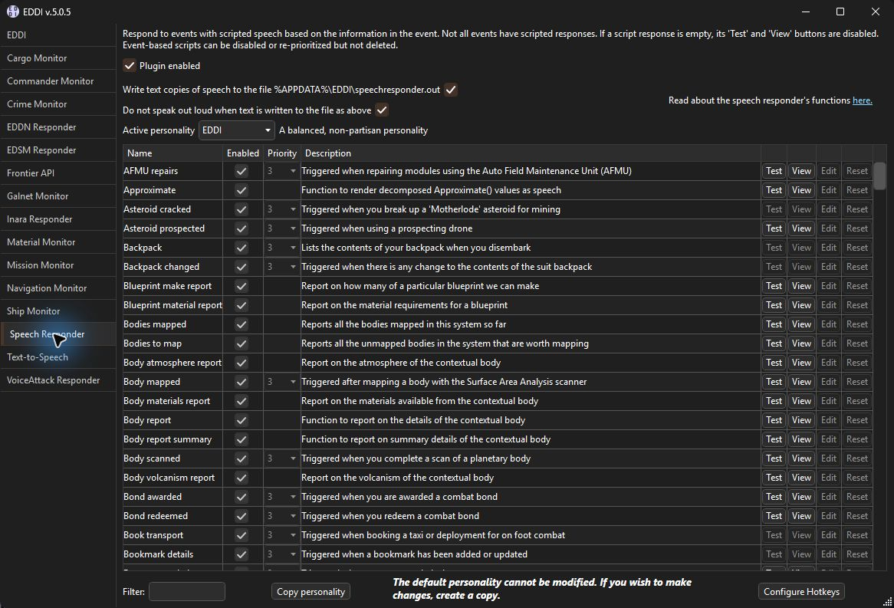
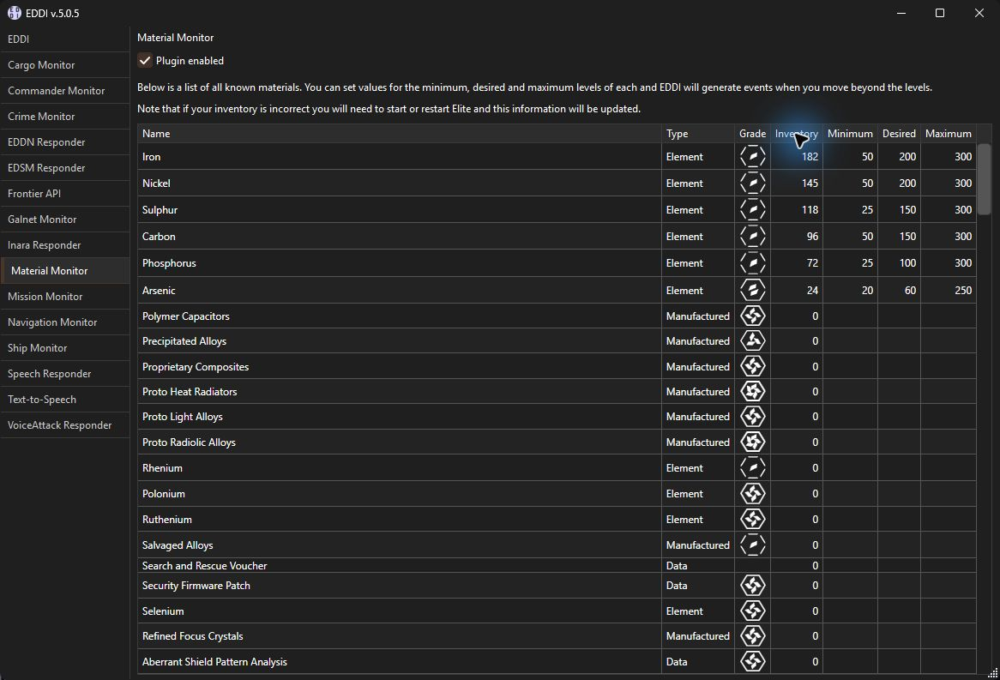
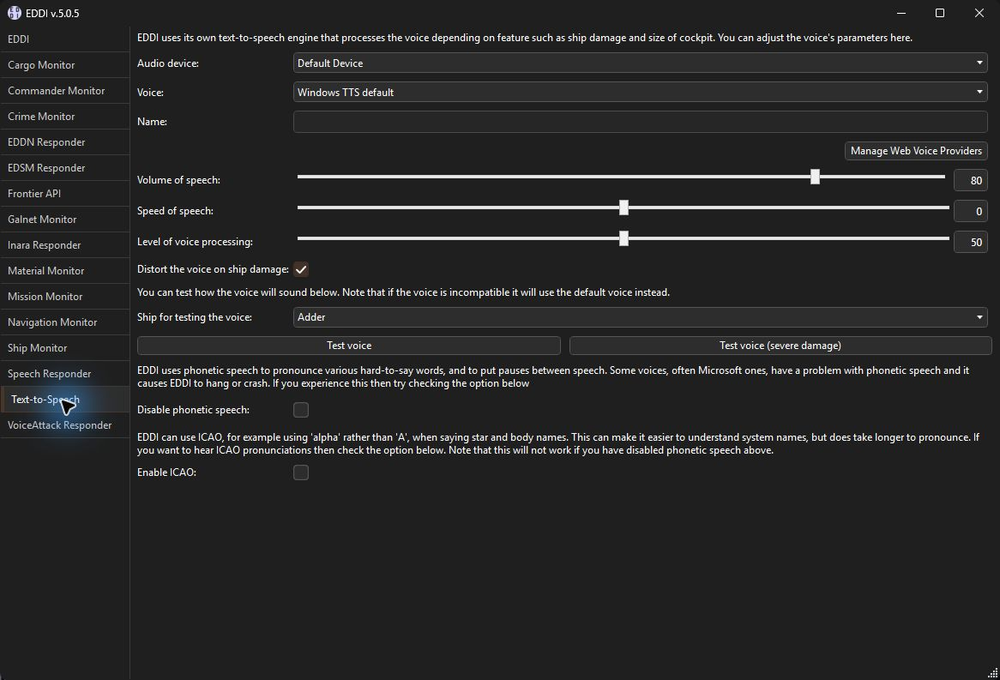
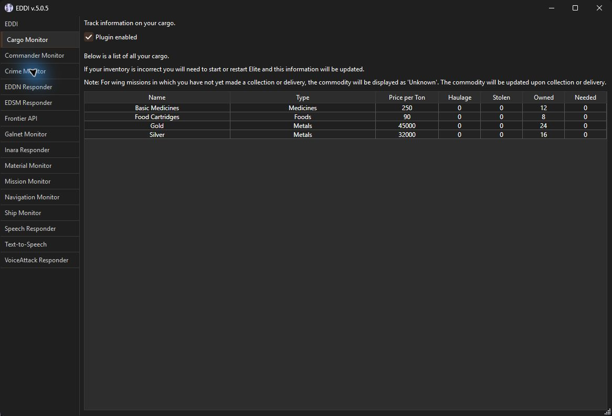
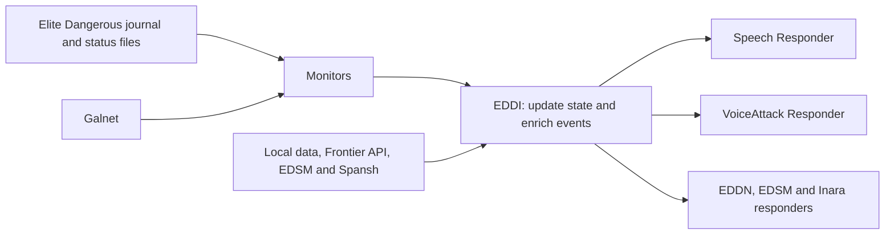

| Branch | Status |
|--------|--------|
| stable |  |
| beta |  |
| develop |  |

# EDDI: The Elite Dangerous Data Interface

EDDI is a Windows companion for Elite Dangerous. It turns game events into spoken reports, keeps useful information about your commander and fleet, and connects your adventures to community tools. Run it on its own or use it with VoiceAttack to build commands that react to what is happening in-game.

[Download EDDI](https://github.com/EDCD/EDDI/releases) · [User guide](https://github.com/EDCD/EDDI/wiki) · [Change log](ChangeLog.md) · [Troubleshooting](TROUBLESHOOTING.md)

## What can EDDI do?

| Feature | What you can do |
|---------|----------------|
| Spoken reports | Hear responses to events such as jumps, docking, exploration, and missions. Choose a personality, enable the responses you want, or copy a personality and customize its scripts. |
| Voice selection | Choose installed Windows text-to-speech voices or configure Amazon Polly or Azure Speech Services. Select an output audio device from the Text-to-Speech tab. |
| VoiceAttack integration | Use commander, ship, system, and event variables in your commands, trigger commands when events occur, and call EDDI's plugin actions. |
| Materials | Track inventory and set minimum and desired amounts, with events when material levels cross configured limits. |
| Navigation | Keep bookmarks, browse galactic points of interest, inspect your plotted route, and plan ship or fleet carrier routes. |
| Ships, cargo, and missions | Review your fleet and ship details, track owned, stolen, and mission cargo, and see mission destinations, status, and time remaining. |
| Commander and crime | Set a home system and station, track fines and bounties, and search for an Interstellar Factors contact. |
| Fleet carriers | Keep carrier state available to scripts and responders as carrier events occur; use the Navigation Monitor for carrier route planning. |
| Community data | Send supported game data to EDDN, keep an EDSM travel log, or update your Inara commander profile using the corresponding responders. |
| Galnet | Receive events when new Galnet articles are published. |

EDDI also offers Light, Dark, Classic, and System themes. Configure optional monitors and responders in the application; some core monitors are required and run in the background rather than having their own tab.

## See EDDI in action

These screenshots use EDDI 5.0.5 with a disposable demonstration profile and no commander account data.

| Event-driven speech | Material inventory targets |
|---------------------|----------------------------|
|  |  |
| **Voice and audio controls** | **Cargo tracking** |
|  |  |

## Get started

1. Download an installer from the [releases page](https://github.com/EDCD/EDDI/releases) and run it with Elite Dangerous and VoiceAttack closed.
2. Start EDDI and explore its configuration tabs. Choose a voice on **Text-to-Speech**, then select and test responses on **Speech Responder**.
3. Configure the community integrations you want to use. EDSM and Inara have their own account settings; use the instructions in their tabs.
4. Start Elite Dangerous. EDDI reads the game's journal and status files to follow your session.

Current installers keep the EDDI application separate from the VoiceAttack plugin. The default application location is `%LOCALAPPDATA%\EDDI\Application` for a per-user installation or the system Program Files directory under `EDDI` for an all-users installation. Follow the installer's VoiceAttack Apps directory selection when using the plugin.

To build EDDI yourself, see [Development dependencies](Development%20dependencies.md).

## Use EDDI with VoiceAttack

Current EDDI versions require **VoiceAttack 2**. EDDI 4.1.9 and earlier supported VoiceAttack 1.

Install EDDI with the plugin directed to your VoiceAttack 2 Apps directory. In VoiceAttack, enable **Enable plugin support**, restart VoiceAttack, and check for the EDDI plugin initialization message. The main EDDI application does not need to be installed inside that Apps directory.

EDDI provides variables for your commands and can run commands in response to game events. The supplied `EDDI.vap` profile demonstrates ways to interact with EDDI; it is not a ship-control profile. See the [VoiceAttack integration guide](https://github.com/EDCD/EDDI/wiki/VoiceAttack-Integration) for variables, events, and plugin actions. Older setup examples may show the previous installation layout; use the current installer for directory selection.

## Make EDDI sound like your copilot

Use **Speech Responder** to select a personality, choose which events speak, and test responses. Copy a personality to create your own, then edit its Cottle scripts to use event data and EDDI's knowledge of your commander, ship, and surroundings.

Use **Text-to-Speech** to select a voice and output device. EDDI supports installed Windows TTS voices as well as optional cloud providers:

- [Amazon Polly setup](Amazon%20Polly.md)
- [Azure Speech Services setup](Azure%20Speech%20Services.md)
- [Pronunciation lexicons](Lexicons.md)

Cloud voices require the provider's account and credentials, an internet connection, and may incur usage charges. Installed voices must be available to Windows' TTS system to appear in EDDI.

## How it works

```mermaid
flowchart LR
    Game["Elite Dangerous journal and status files"] --> Monitors["Monitors"]
    News["Galnet"] --> Monitors
    Monitors --> Core["EDDI: update state and enrich events"]
    Data["Local data, Frontier API, EDSM and Spansh"] --> Core
    Core --> Speech["Speech Responder"]
    Core --> VA["VoiceAttack Responder"]
    Core --> Community["EDDN, EDSM and Inara responders"]
```

Monitors read incoming information and track state. EDDI processes events and enriches them with available information before handing them to responders, which speak, expose variables and trigger VoiceAttack commands, or send supported data to community services.

The active monitor set covers **Journal, Status, Commander, Ship, Cargo, Material, Mission, Crime, Navigation, Fleet Carrier, and Galnet**. Journal and Status provide the underlying game events and live status used by other features. The legacy EDDP monitor remains disabled and is not an available feature.

Community lookups and online responders depend on their services being available. What EDDI knows also depends on the game data it has received and the integrations you have configured.

## Upgrade EDDI

Close EDDI and VoiceAttack, then run the newer installer. For EDDI 2 and later, the installer handles upgrades. Back up `%APPDATA%\EDDI` if you want a separate copy of your settings and custom personalities before upgrading.

For a legacy EDDI 1 installation, back up that directory before uninstalling or removing old configuration, and consult the release notes before moving to a current version.

## Troubleshooting

Start with the [troubleshooting guide](TROUBLESHOOTING.md). If you still need help, [check existing issues or report a problem](https://github.com/EDCD/EDDI/issues), including your EDDI version and the steps needed to reproduce it.

## Uninstall EDDI

Uninstall EDDI through Windows' installed-apps settings. EDDI stores user configuration and data in `%APPDATA%\EDDI`; remove that folder only if you also want to discard your settings and custom personalities.

## Thanks

We would like to express our gratitude to the various products, services, and APIs which make EDDI's development possible, including:

- https://github.com/r3c/cottle
- https://github.com/icsharpcode/AvalonEdit
- https://github.com/JamesNK/Newtonsoft.Json
  
Note: Logos and trademarks in this section are not the property of the EDDI development team. These are sourced from publicly available press kits or otherwise used with permission.
