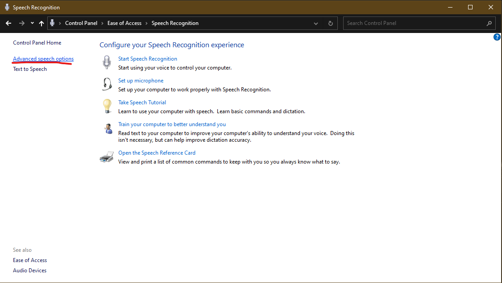
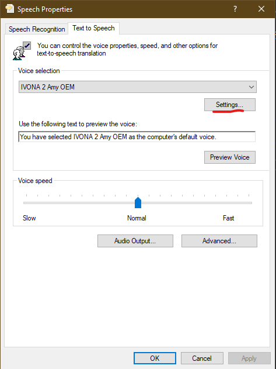
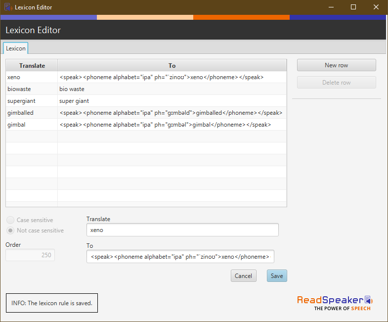

# User Lexicons

Advanced users may wish to customize voice pronunciations. This is possible via lexicon files. The method for generating lexicon files differs for different kinds of [voices](##Voices) and different [phonetic alphabets](##Alphabets).

## Voices

### Standard voices

If you have selected a voice which supports it (including many Microsoft voices), you can create a `lexicons` directory inside of your configuration directory (e.g. `%appdata%/EDDI/lexicons`) and add a [.pls formatted lexicon file](https://www.w3.org/TR/pronunciation-lexicon/) to customize EDDI's pronuncations. 

Each voice has an encoded culture code in the format `en-us`, where the first two letters represent the language and the second two letters represent the region. 

Please name the .pls file you've created to match the culture code of the voice or voices you'd like to match (e.g. \"en-gb.pls\" for British voices or \"en-us.pls\" for United States voices). You can also use a two letter culture code to apply the pronunciation more broadly (e.g. \"en.pls\" to apply the pronunciation all English languages) , though if the same grapheme is defined by multiple lexicons then the more specific language code will be preferred. 

Within the .pls file, match the value of the \"xml:lang\" attribute to the culture code you've chosen.

Some common English voices with corresponding culture codes are listed below for reference:

|Voice|Culture Code|
|---|---|
|Catherine|en-au|
|David|en-us|
|George|en-gb|
|Hazel|en-gb|
|James|en-au|
|Linda|en-ca|
|Mark|en-us|	
|Richard|en-ca|
|Sean|en-ie|
|Susan|en-gb|
|Zira|en-us|

An example of a simple .pls file is given below which changes the pronunciation of `apple` to `orange`:

```
<?xml version="1.0" encoding="UTF-8"?>
<lexicon version="1.0" 
      xmlns="http://www.w3.org/2005/01/pronunciation-lexicon"
      xmlns:xsi="http://www.w3.org/2001/XMLSchema-instance" 
      xsi:schemaLocation="http://www.w3.org/2005/01/pronunciation-lexicon 
        http://www.w3.org/TR/2007/CR-pronunciation-lexicon-20071212/pls.xsd"
      alphabet="ipa" xml:lang="en-gb">
  <lexeme>
    <grapheme>apple</grapheme>
    <phoneme>ˈɔɹɪnd͡ʒ</phoneme>
  </lexeme>
</lexicon>
```

Save the .pls file once you are done editing. The revised pronunciation will be available in EDDI immediately.

### Ivona voices

Ivona voice installers include a Lexicon Editor utility. The utility can be used to change word pronunciations, and includes support for phonemes. 

To access the Lexicon Editor utility, from the Control Panel navigate to `Ease of Access` then `Speech Recognition` then `Advanced speech options`. 



Open the Text to Speech tab, make sure that your Ivona voice is selected, then hit the `Settings` button to open the Lexicon Editor.



To use phonemes in the Lexicon Editor, you need to translate the word you want to correct to an SSML phoneme tag using the [IPA](###IPA) or [X-SAMPA](###X-SAMPA) alphabets. 



The Lexicon Editor accepts simple phonetic changes like adding spacing between words (e.g. from "supergiant" to "super giant")

The Lexicon Editor also supports the [IPA](###IPA) or [X-SAMPA](###X-SAMPA) alphabets to create phoneme pronunciations in SSML. To ensure that these are interpreted correctly, we recommend enclosing the IPA pronunciations in [SSML tags](https://www.w3.org/TR/2004/REC-speech-synthesis-20040907/#S3.1.9), e.g.

- Word: `gimballed`
- IPA: `ɡɪmbəlɗ`
- Wrapped in SSML tags: `<speak><phoneme alphabet="ipa" ph="ɡɪmbəlɗ">gimballed</phoneme></speak>`

Notes:
- Changes take effect immediately after saving (you do not need to restart EDDI)
- Changes match on partial words so adjusting the pronunciation of "xeno" will also influence the pronunciation of words like "xenobiology" or "anti-xeno".

### Cereproc voices

CereProc SAPI5 voices support the addition of a user lexicon as follows:

- Navigate to the Cereproc voice file. If you've installed to the default directory, this should be `C:\Program Files (x86)\CereProc\CereVoice [voice] 6.0.0\` (where `[voice]` is the specific name of the Cereproc voice you have installed, e.g. Heather, Caitlin, etc.).
- In the same directory as the voice file, add a new text file called `user_lexicon.txt`.
- Open the file and add new lexicon entries (or override existing ones) by adding a *headword* and *pronunciation*, one per line, separated by a single space, e.g.
     >test v_oi1_s
- The *headword* should be lower case, and consist of alphabetic characters only (to process a string that includes non-alphabetic characters, use an [abbreviations file](https://www.cereproc.com/files/CereVoiceCloudGuide.pdf#%5B%7B%22num%22%3A305%2C%22gen%22%3A0%7D%2C%7B%22name%22%3A%22XYZ%22%7D%2C0%2C656%2C0%5D))
- The *pronunciation* may either use the [IPA](###IPA) or [Cereproc](###Cereproc) alphabets.
- When you are done editing, save the file and then restart EDDI or any other Text to Speech applications to allow the changes to take effect.

## Alphabets

### IPA

IPA is the International Phonetic Alphabet. The IPA alphabet includes non-ASCII symbols which must be pasted into the program rather than typed, though many online dictionaries provide IPA pronunciations which can readily be pasted into any lexicon.
 
Here are examples of the word “xeno” using IPA:

- ˈzinoʊ
- ˈzinə
- ˈzɛnə
- ˈzɛnoʊ

### Cereproc

The Cereproc alphabet is documented [here](https://www.cereproc.com/files/CereVoicePhoneSets.pdf) and is used in a lexicon as described [here](https://www.cereproc.com/files/CereVoiceCloudGuide.pdf#%5B%7B%22num%22%3A303%2C%22gen%22%3A0%7D%2C%7B%22name%22%3A%22XYZ%22%7D%2C0%2C804%2C0%5D).

This example will change the pronunciation of the word 'test' to 'voice':

>test v_oi1_s

All vowel phenomes require a stress marker:

1 = primary stress  
2 = secondary stress  
0 = no stress

> plane p_l_ei1_n  
> planeload p_l_ei1_n_l_ou2_d  
> voices v_oi1_s_i0_z

If words with accented characters are added, the encoding must be UTF-8.

### X-SAMPA

X-SAMPA is a computer-readable phonetic script using 7-bit printable ASCII characters, based on the International Phonetic Alphabet (IPA). X-SAMPA was devised at a time when Unicode text encoding formats did not support IPA symbols but is typically no longer necessary since Unicode support for IPA symbols has become much more widespread. For more details on the X-SAMPA alphabet, please see [here](https://en.wikipedia.org/wiki/X-SAMPA).
