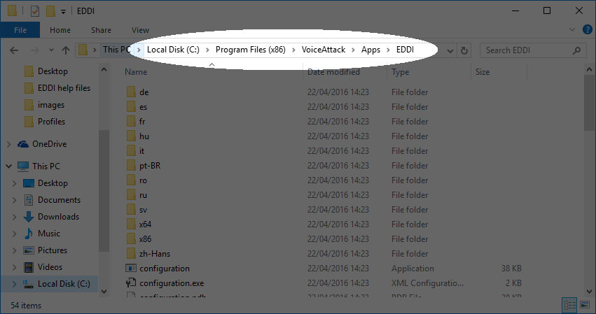
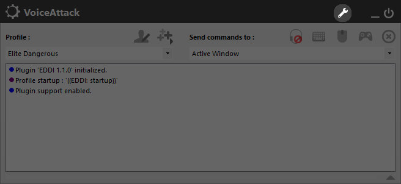
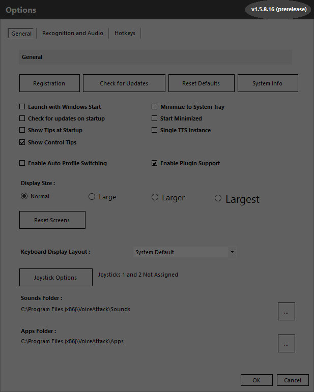
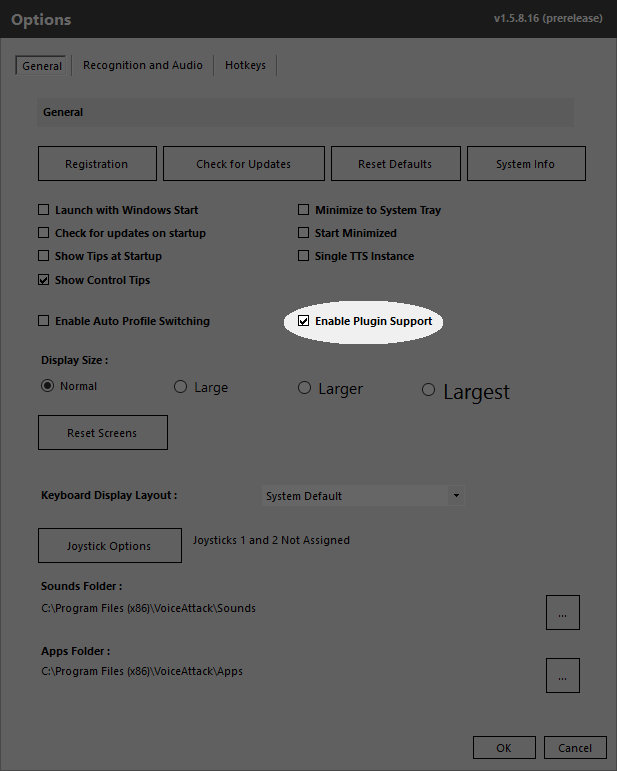

# Troubleshooting

# General Issues

If EDDI is not working properly then there are a number of items you should check.

## Ensure that EDDI is running

EDDI can be started with the EDDI.exe program or by starting VoiceAttack with the EDDI plugin.  Note that you should only do one of these, as otherwise you will have to separate copies of EDDI running and will hear speech twice, etc.

## Ensure that you have configured EDDI

EDDI has a number of configuration items.  Although they are not required, parts of EDDI will not work without them.  Start up the EDDI.exe program and read through the instructions presented on the first tab to ensure that you have configured all of your required information.

# Specific Issues

## EDDI is not saying anything when I jump to another system

The common cause of this problem is that you have not configured your netlog monitor.  To configure your netlog:

  - shut down VoiceAttack if running
  - start up EDDI
  - in the "Netlog monitor" tab ensure that "plugin enabled" is checked
  - in the "Product logs directory" ensure that you are pointing to your product logs
  - shut down EDDI
  - restart EDDI (or VoiceAttack if you are using that)

## EDDI is not giving me suggestions of which commodities to purchase when I dock at a station

To obtain the commodity information EDDI needs access to the companion API.  This requires that the user has configured their "Companion App" tab on the EDDI interface.

If this has been done then the other common problem is that you are flying in a ship that is set for trading.  Ensure that your ship is configured for either "Trading" or "Multi-purpose" in the "Shipyard" tab on the EDDI interface.

## EDDI is not using the voice that I configured for it

Windows comes with a small number of text-to-speech voices, most of which can be used for EDDI.  There are a number of methods to obtain additional free voices on the internet but these often result in voices that do not provide the full range of functionality, specifically they do not have the ability to provide phonetic pronunciation.  If EDDI detects that a chosen voice is failing to use phonetic pronunciation it will fall back to using normal speech, or halt the voice entirely depending on the error found.

If you want to have a high-quality voice other than that available with Windows then the best choices are to purchase voices from either Ivona or Cereproc.  These provide full functionality for phonetic speech and will give the best result with EDDI.

An alternative is to disable phonetic speech yourself and use one of the other free voices.  To disable phonetic speech:

  - shut down VoiceAttack if running
  - start up EDDI
  - in the "Text-to-speech" tab check "Disable phonetic speech"
  - shut down EDDI
  - restart EDDI (or VoiceAttack if you are using that)

However be aware that with phonetic speech disabled a number of advanced features such as pauses in the middle of speech and correct pronunciation of names (ships, powers, systems, etc.) will not be as accurate as would be with phonetic speech.

# Issues with VoiceAttack Integration

If EDDI is not working with VoiceAttack then there are a number of additional items you should check.
## Ensure EDDI is in the correct place

EDDI should be in the "Apps" subdirectory of your VoiceAttack directory.  The directory structure should look like this:

## Ensure you are running a suitable version of VoiceAttack

EDDI requires at least version 1.5.12 of VoiceAttack.  To check the version of VoiceAttack first select the configuration button on the main VoiceAttack window:

The version number is in the top right of the window.

## Ensure that VoiceAttack plugins are enabled

To ensure that plugins are enabled first select the configuration button on the main VoiceAttack window:

Then confirm that plugin support is enabled.

