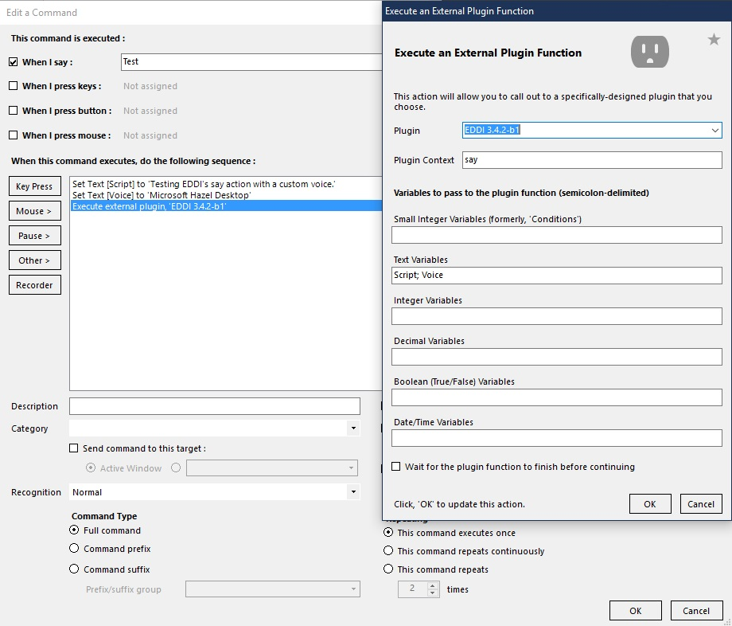

EDDI integrates with VoiceAttack in two ways.  Firstly, it generates a large number of variables inside VoiceAttack and keeps them up-to-date.  Secondly, it runs VoiceAttack commands when events occur.

# Using EDDI with VoiceAttack

N.B. EDDI requires at least version 1.6.0 of VoiceAttack to function correctly.

For EDDI to work with VoiceAttack it must be installed as a VoiceAttack plugin.  To do this EDDI should be installed within the `Apps` directory of your VoiceAttack installation; by default VoiceAttack installs in one of two locations: 
- `C:\Program Files (x86)\VoiceAttack` (for standard licenses)
- `C:\Program Files (x86)\Steam\steamapps\common\VoiceAttack` (for Steam licenses)

VoiceAttack must be configured to use plugins.  To do so you must click on the Settings icon (a spanner) in the top-right corner of the VoiceAttack and check the 'Enable plugin support' option and restart VoiceAttack.

If EDDI is installed in the correct location and plugin support is enabled you should see a message when starting VoiceAttack along the lines of `Plugin EDDI 3.7.1 initialized`.

## EDDI's VoiceAttack Profile

EDDI provides a VoiceAttack profile with some basic commands.  This is not a control profile, in that it does not provide you with the ability to control the ship, it does allow the user to interact with EDDI with phrases such as "please could you repeat that" and questions such as "what use is decoded emission data?"  It also allows you to bring up EDDI's configuration UI with the "Configure EDDI" command.

The profile is available in the EDDI installation directory as EDDI.vap.

**_Disclaimer: We recommend that users check the terms and conditions of third party licensing agreements prior to linking or using EDDI's VoiceAttack profile with any licensed third party product. We shall not be held responsible for any third party licensing claims that arise from breaches of third party licensing agreements._**

# EDDI Variables in VoiceAttack

EDDI makes a large number of values available to augment your existing scripts.  These variables are available at all times.

## Commander Variables

  * {TXT:Name}: the name of the commander
  * {INT:Combat rating}: the combat rating of the commander, with 0 being Harmless and 8 being Elite
  * {TXT:Combat rank}: the combat rank of the commander, from Harmless to Elite
  * {INT:Trade rating}: the trade rating of the commander, with 0 being Penniless and 8 being Elite
  * {TXT:Trade rank}: the trade rank of the commander, from Penniless to Elite
  * {INT:Explore rating}: the exploration rating of the commander, with 0 being Aimless and 8 being Elite
  * {TXT:Explore rank}: the exploration rank of the commander, from Aimless to Elite
  * {INT:Empire rating}: the empire rating of the commander, with 0 being None and 14 being King
  * {TXT:Empire rank}: the empire rating of the commander, from None to King
  * {INT:Federation rating}: the federation rating of the commander, with 0 being None and 14 being Admiral
  * {TXT:Federation rank}: the federation rating of the commander, from None to Admiral
  * {DEC:Credits}: the number of credits owned by the commander
  * {TXT:Credits (spoken)}: the number of credits owned by the commander as would be spoken (e.g. "just over 2 million")
  * {DEC:Debt}: the number of credits owed by the commander
  * {TXT:Debt}: the number of credits owed by the commander as would be spoken (e.g. "a little under 100 thousand")
  * {DEC:Insurance}: the percentage insurance excess for the commander (usually 5, 3.75 or 2.5)

## Status Variables
  * {TXT:Status vehicle}: the vehicle that is under the commander's control.  Can be one of "Ship", "SRV" or "Fighter"
  * {BOOL:Status being interdicted} a boolean value indicating whether the commander is currently being interdicted
  * {BOOL:Status in danger} a boolean value indicating whether the commander is currently in danger
  * {BOOL:Status near surface} a boolean value indicating whether the commander is near a landable surface (within it's gravity well)
  * {BOOL:Status overheating} a boolean value indicating whether the commander's vehicle is overheating
  * {BOOL:Status low fuel} a boolean value indicating whether the commander has less than 25% fuel remaining
  * {TXT:Status fsd status} the current status of the ship's frame shift drive. Can be one of "ready", "cooldown", "charging", or "masslock"
  * {BOOL:Status srv drive assist} a boolean value indicating whether SRV drive assist is active
  * {BOOL:Status srv under ship} a boolean value indicating whether the SRV in within the proximity zone around the ship
  * {BOOL:Status srv turret deployed} a boolean value indicating whether the SRV's turret has been deployed
  * {BOOL:Status srv handbrake activated} a boolean value indicating whether the SRV's handbrake has been activated
  * {BOOL:Status scooping fuel} a boolean value indicating whether the ship is currently scooping fuel
  * {BOOL:Status silent running} a boolean value indicating whether silent running is active
  * {BOOL:Status cargo scoop deployed} a boolean value indicating whether the cargo scoop has been deployed
  * {BOOL:Status lights on} a boolean value indicating whether the vehicle's external lights are active
  * {BOOL:Status in wing} a boolean value indicating whether the commander is currently in a wing
  * {BOOL:Status hardpoints deployed} a boolean value indicating whether hardpoints are currently deployed
  * {BOOL:Status flight assist off} a boolean value indicating whether flight assistance has been deactivated
  * {BOOL:Status supercruise} a boolean value indicating whether the ship is currently in supercruise
  * {BOOL:Status shields up} a boolean value indicating whether the ship's shields are maintaining their integrity
  * {BOOL:Status landing gear down} a boolean value indicating whether the ship's landing gears have been deployed
  * {BOOL:Status landed} a boolean value indicating whether the ship is currently landed (on a surface)
  * {BOOL:Status docked} a boolean value indicating whether the ship is currently docked (at a station)
  * {BOOL:Status analysis mode} a boolean value indicating whether the ship is currently in analysis mode
  * {BOOL:Status night vision} a boolean value indicating whether the ship's night vision is currently active
  * {DEC:Status system pips} a decimal value indicating the power distributor allocation to systems
  * {DEC:Status engine pips} a decimal value indicating the power distributor allocation to engines
  * {DEC:Status weapon pips} a decimal value indicating the power distributor allocation to weapons
  * {INT:Status firegroup} an integer value indicating the ship's currently selected firegroup (this is a zero based count, so your first firegroup will be '0')
  * {TXT:Status gui focus} the commander's current focus. Can be one of "none", "internal panel" (right panel), "external panel" (left panel), "communications panel" (top panel), "role panel" (bottom panel), "station services", "galaxy map", "system map", "orrery", "fss mode", "saa mode", or "codex"
  * {DEC:Status latitude} a decimal value indicating the ship's current latitude (if near a surface)
  * {DEC:Status longitude} a decimal value indicating the ship's current longitude (if near a surface)
  * {DEC:Status altitude} a decimal value indicating the ship's current altitude (if in flight near a surface)
  * {DEC:Status heading} a decimal value indicating the ship's current heading (if near a surface)
  * {DEC:Status slope} a decimal value indicating the ship's current slope relative to the horizon (if near a surface)
  * {DEC:Status fuel} a decimal value indicating the tons of fuel currently carried by your ship, if known
  * {DEC:Status fuel percent} a decimal value indicating the current percentage of your total fuel capacity remaining, if known
  * {INT:Status fuel rate} an integer value indicating the projected number of seconds of fuel remaining, if known
  * {INT:Status cargo carried} an integer value indicating the number of tons of cargo currently carried, if known
  * {TXT:Status legal status} the ship's current legal status. Can be one of "Clean", "Illegal cargo", "Speeding", "Wanted", "Hostile", "Passenger wanted", or "Warrant"
  * {TXT:Status body name} the name of the current body (if landed or in an srv)
  * {DEC:Status planet radius} the radius of the current body (if landed or in an srv)
  * {BOOL:Status altitude from average radius} true if the altitude is computed relative to the average radius (which is used at higher altitudes) rather than surface directly below the srv

## Ship Variables
Note: "Tiny" hardpoints are utility slots.
  * {TXT:Ship manufacturer}: (e.g. "Lakon", "Core Dynamics")
  * {TXT:Ship model}: the model of the ship (e.g. "Cobra Mk", "Fer-de-Lance")
  * {TXT:Ship model (spoken)}: the model of the ship as would be spoken (e.g. "Cobra Mark 4")
  * {TXT:Ship name}: the name of the ship
  * {TXT:Ship name (spoken)}: the name of the ship as would be spoken
  * {TXT:Ship ident}: the ID of the ship
  * {TXT:Ship ident (spoken)}: the ID of the ship as would be spoken using the ICAO alphabet
  * {TXT:Ship callsign}: the callsign of the ship (e.g. "Gutamaya MCD")
  * {TXT:Ship callsign (spoken)}: the callsign of the ship as would be spoken using the ICAO alphabet
  * {TXT:Ship role}: the role of the ship as set in EDDI configuration (Multipurpose, Combat, Exploration, Trading, Mining, Smuggling)
  * {TXT:Ship size}: the size of the ship (Small, Medium, or Large)
  * {DEC:Ship value}: the replacement cost of the ship plus modules
  * {TXT:Ship value (spoken)}: the replacement cost of the ship plus modules as would be spoken
  * {DEC:Ship hull value}: the replacement cost of the ship's hull
  * {TXT:Ship hull value (spoken)}: the replacement cost of the ship's hull as would be spoken
  * {DEC:Ship modules value}: the replacement cost of the ship's modules
  * {TXT:Ship modules value (spoken)}: the replacement cost of the ship's modules as would be spoken
  * {DEC:Ship rebuy}: the insurance rebuy for the ship in credits
  * {TXT:Ship rebuy (spoken)}: the insurance rebuy for the ship in credits as would be spoken
  * {INT:Ship cargo capacity}: the maximum cargo capacity of the ship as currently configured
  * {INT:Ship cargo carried}: the cargo currently being carried by the ship
  * {INT:Ship limpets carried}: the number of limpets currently being carried by the ship
  * {DEC:Ship health}: the last reported percentage health of the ship's hull
  * {INT:Ship hot}: true if the ship is currently wanted
  * {TXT:Ship bulkheads}: the type of bulkheads fitted to the ship (e.g. "Military Grade Composite")
  * {INT:Ship bulkheads class}: the class of bulkheads fitted to the ship (e.g. 3)
  * {TXT:Ship bulkheads grade}: the grade of bulkheads fitted to the ship (e.g. "A")
  * {DEC:Ship bulkheads health}: the last reported percentage health of the bulkheads fitted to the ship
  * {DEC:Ship bulkheads cost}: the purchase cost of the bulkheads
  * {DEC:Ship bulkheads value}: the undiscounted cost of the bulkheads
  * {DEC:Ship bulkheads discount}: the percentage discount of the purchased bulkheads against the undiscounted cost
  * {TXT:Ship power plant}: the name of power plant fitted to the ship
  * {INT:Ship power plant class}: the class of bulkheads fitted to the ship (e.g. 3)
  * {TXT:Ship power plant grade}: the grade of bulkheads fitted to the ship (e.g. "A")
  * {DEC:Ship power plant health}: the last reported percentage health of the power plant fitted to the ship
  * {DEC:Ship power plant cost}: the purchase cost of the power plant
  * {DEC:Ship power plant value}: the undiscounted cost of the power plant
  * {DEC:Ship power plant discount}: the percentage discount of the purchased power plant against the undiscounted cost
  * {TXT:Ship thrusters}: the name of thrusters fitted to the ship
  * {INT:Ship thrusters class}: the class of thrusters fitted to the ship (e.g. 3)
  * {TXT:Ship thrusters grade}: the grade of thrusters fitted to the ship (e.g. "A")
  * {DEC:Ship thrusters health}: the last reported percentage health of the thrusters fitted to the ship
  * {DEC:Ship thrusters cost}: the purchase cost of the thrusters
  * {DEC:Ship thrusters value}: the undiscounted cost of the thrusters
  * {DEC:Ship thrusters discount}: the percentage discount of the purchased thrusters against the undiscounted cost
  * {TXT:Ship frame shift drive}: the name of frame shift drive fitted to the ship
  * {INT:Ship frame shift drive class}: the class of frame shift drive fitted to the ship (e.g. 3)
  * {TXT:Ship frame shift drive grade}: the grade of frame shift drive fitted to the ship (e.g. "A")
  * {DEC:Ship frame shift drive health}: the last reported percentage health of the frame shift drive fitted to the ship
  * {DEC:Ship frame shift drive cost}: the purchase cost of the frame shift drive
  * {DEC:Ship frame shift drive value}: the undiscounted cost of the frame shift drive
  * {DEC:Ship frame shift drive discount}: the percentage discount of the purchased frame shift drive against the undiscounted cost
  * {TXT:Ship life support}: the name of life support fitted to the ship (e.g. "6D")
  * {INT:Ship life support class}: the class of life support fitted to the ship (e.g. 3)
  * {TXT:Ship life support grade}: the grade of life support fitted to the ship (e.g. "A")
  * {DEC:Ship life support health}: the last reported percentage health of the life support fitted to the ship
  * {DEC:Ship life support cost}: the purchase cost of the life support
  * {DEC:Ship life support value}: the undiscounted cost of the life support
  * {DEC:Ship life support discount}: the percentage discount of the purchased life support against the undiscounted cost
  * {TXT:Ship power distributor}: the name of power distributor fitted to the ship
  * {INT:Ship power distributor class}: the class of power distributor fitted to the ship (e.g. 3)
  * {TXT:Ship power distributor drive grade}: the grade of power distributor fitted to the ship (e.g. "A")
  * {DEC:Ship power distributor health}: the last reported percentage health of the power distributor fitted to the ship
  * {DEC:Ship power distributor cost}: the purchase cost of the power distributor
  * {DEC:Ship power distributor value}: the undiscounted cost of the power distributor
  * {DEC:Ship power distributor discount}: the percentage discount of the purchased power distributor against the undiscounted cost
  * {TXT:Ship sensors}: the name of sensors fitted to the ship
  * {INT:Ship sensors class}: the class of sensors fitted to the ship (e.g. 3)
  * {TXT:Ship sensors drive grade}: the grade of sensors fitted to the ship (e.g. "A")
  * {DEC:Ship sensors health}: the last reported percentage health of the sensors fitted to the ship
  * {DEC:Ship sensors cost}: the purchase cost of the sensors
  * {DEC:Ship sensors value}: the undiscounted cost of the sensors
  * {DEC:Ship sensors discount}: the percentage discount of the purchased sensors against the undiscounted cost
  * {TXT:Ship fuel tank}: the name of the main fuel tank fitted to the ship
  * {INT:Ship fuel tank class}: the class of the main fuel tank fitted to the ship (e.g. 3)
  * {TXT:Ship fuel tank drive grade}: the grade of the main fuel tank fitted to the ship (e.g. "A")
  * {DEC:Ship fuel tank cost}: the purchase cost of the the main fuel tank
  * {DEC:Ship fuel tank value}: the undiscounted cost of the the main fuel tank
  * {DEC:Ship fuel tank discount}: the percentage discount of the purchased main fuel tank against the undiscounted cost
  * {DEC:Ship fuel tank capacity}: the capacity of the main fuel tank
  * {DEC:Ship total fuel tank capacity}: the capacity of the main fuel tank plus all additional fuel tanks
  * {BOOL:Ship tiny/small/medium/large/huge hardpoint *n* occupied}: true if there is a module in this slot, otherwise false
  * {TXT:Ship tiny/small/medium/large/huge hardpoint *n* module}: the name of the module in this slot
  * {INT:Ship tiny/small/medium/large/huge hardpoint *n* module class}: the class of the module in this slot
  * {TXT:Ship tiny/small/medium/large/huge hardpoint *n* module grade}: the grade of the module in this slot
  * {DEC:Ship tiny/small/medium/large/huge hardpoint *n* module health}: the last reported percentage health of the module in this slot
  * {DEC:Ship tiny/small/medium/large/huge hardpoint *n* module cost}: the purchase cost of the module in this slot
  * {DEC:Ship tiny/small/medium/large/huge hardpoint *n* module value}: the undiscounted cost of the module in this slot
  * {DEC:Ship tiny/small/medium/large/huge hardpoint *n* module discount}: the percentage discount of the purchased module against the undiscounted cost
  * {INT:Ship hardpoints} the total number of filled hardpoints slots (to use when looping through hardpoint data)
  * {INT:Ship Compartment *n* size}: the size of this slot
  * {BOOL:Ship Compartment *n* occupied}: true if there is a module in this slot, otherwise false
  * {TXT:Ship compartment *n* module}: the name of the module in this slot
  * {INT:Ship compartment *n* module class}: the class of the module in this slot
  * {TXT:Ship compartment *n* module grade}: the grade of the module in this slot
  * {DEC:Ship compartment *n* module health}: the last reported percentage health of the module in this slot
  * {DEC:Ship compartment *n* module cost}: the purchase cost of the module in this slot
  * {DEC:Ship compartment *n* module value}: the undiscounted cost of the module in this slot
  * {DEC:Ship compartment *n* module station cost}: the purchase cost of the module at this station
  * {INT:Ship compartments} the total number of filled compartment slots (to use when looping through compartment data)

### Stored ship variables
  * {TXT:Ship system}: the name of the star system where the ship is stored
  * {TXT:Ship station}: the name of the station where the ship is stored
  * {DEC:Ship distance}: the distance to the star system where the ship is stored

## Current System Variables

  * {TXT:System name}: the name of the system
  * {TXT:System name (spoken)}: the name of the system as would be spoken
  * {DEC:System distance from home}: the number of lights years between this system and the your home system, to two decimal places
  * {INT:System visits}: the number of times the commander has visited the system (whilst the plugin has been active)
  * {DATE:System previous visit}: the last time the commander visited the system (empty if this is their first visit)
  * {DEC:System minutes since previous visit}: the number of minutes since the commander's last visit to the system
  * {DEC:System population}: the population of the system
  * {TXT:System population (spoken)}: the population of the system as would be spoken (e.g. "nearly 12 and a half billion")
  * {TXT:System allegiance}: the allegiance of the system ("Federation", "Empire", "Alliance", "Independant" or empty)
  * {TXT:System government}: the government of the system (e.g. "Democracy")
  * {TXT:System faction}: the primary faction of the system (e.g. "The Pilots' Federation")
  * {TXT:System primary economy}: the primary economy of the system (e.g. "Industrial")
  * {TXT:System state}: the overall state of the system (e.g. "Boom")
  * {TXT:System security}: the security level in the system ("High", "Medium", "Low", "None" or empty)
  * {TXT:System power}: the name of the power that controls the system (e.g. "Aisling Duval")
  * {TXT:System power (spoken)}: the name of the power that controls the system as would be spoken (e.g. "Ashling Du-val")
  * {TXT:System power state}: the state of the power in the system (e.g. "Expansion")
  * {TXT:System rank}: the rank of the Commander in the system (e.g. "Duke" if an Empire system, "Admiral" if a Federation system)
  * {DEC:System X} the X co-ordinate of the system
  * {DEC:System Y} the Y co-ordinate of the system
  * {DEC:System Z} the Z co-ordinate of the system
  * {INT:System stations}: the total number of stations, both in orbit and on planets, in the system
  * {INT:System orbital stations}: the number of orbital stations in the system
  * {INT:System starports}: the total number of orbital starports in the system
  * {INT:System outposts}: the total number of orbital outposts in the system
  * {INT:System planetary stations}: the total number of planetary stations (outposts and ports) in the system
  * {INT:System planetary settlements}: the total number of undockable planetary ports in the system, as reported to EDDB.
  * {INT:System total bodies}: the total number of discoverable bodies within the system.
  * {INT:System scanned bodies}: the total number of bodies you have scanned within the system.
  * {INT:System mapped bodies}: the total number of bodies you have mapped within the system.
  * {BOOL:System requires permit}: Whether a permit is required to enter the system, as reported to EDDB.
  * {TXT:System permit name}: The name of the permit required to enter the system, if any, as reported to EDDB.
  * {TXT:System main star stellar class}: the stellar class of the main star of the system (M, G etc)
  * {INT:System main star age}: the age of the main star of the system, in millions of years

### Last System Variables

  * Like "Current System Variables", except prefixed with `Last system` rather than `System`

### Next System Variables

  * Like "Current System Variables", except prefixed with `Next system` rather than `System`

### Home System Variables

  * Like "Current System Variables", except prefixed with `Home system` rather than `System`

### Squadron System Variables

  * Like "Current System Variables", except prefixed with `Squadron system` rather than `System`

### Destination System Variables

  * Like "Current System Variables", except prefixed with `Destination system` rather than `System`

## Current Station Variables

  * {DEC:Ship bulkheads station cost}: the purchase cost of the bulkheads at the station (not set if not for sale at the station)
  * {DEC:Ship bulkheads station discount}: the number of credits discount of the bulkheads over those currently fitted (not set if no additional discount)
  * {TXT:Ship bulkheads station discount (spoken)}: the number of credits discount of the bulkheads over those currently fitted as would be spoken (not set if no additional discount)
  * {DEC:Ship power plant station cost}: the purchase cost of the power plant at the station (not set if not for sale at the station)
  * {DEC:Ship power plant station discount}: the number of credits discount of the power plant over that currently fitted (not set if no additional discount)
  * {TXT:Ship power plant station discount (spoken)}: the number of credits discount of the power plant over thothatse currently fitted as would be spoken (not set if no additional discount)
  * {DEC:Ship thrusters station cost}: the purchase cost of the thrusters at the station (not set if not for sale at the station)
  * {DEC:Ship thrusters station discount}: the number of credits discount of the thrusters over those currently fitted (not set if no additional discount)
  * {TXT:Ship thrusters station discount (spoken)}: the number of credits discount of the thrusters over those currently fitted as would be spoken (not set if no additional discount)
  * {DEC:Ship frame shift drive station cost}: the purchase cost of the frame shift drive at the station (not set if not for sale at the station)
  * {DEC:Ship frame shift drive station discount}: the number of credits discount of the frame shift drive over those currently fitted (not set if no additional discount)
  * {TXT:Ship frame shift drive station discount (spoken)}: the number of credits discount of the frame shift drive over those currently fitted as would be spoken (not set if no additional discount)
  * {DEC:Ship life support station cost}: the purchase cost of the life support at the station (not set if not for sale at the station)
  * {DEC:Ship life support station discount}: the number of credits discount of the life support over that currently fitted (not set if no additional discount)
  * {TXT:Ship life support station discount (spoken)}: the number of credits discount of the life support over those currently fitted as would be spoken (not set if no additional discount)
  * {DEC:Ship power distributor station cost}: the purchase cost of the power distributor at the station (not set if not for sale at the station)
  * {DEC:Ship power distributor station discount}: the number of credits discount of the power distributor over those currently fitted (not set if no additional discount)
  * {TXT:Ship power distributor station discount (spoken)}: the number of credits discount of the power distributor over those currently fitted as would be spoken (not set if no additional discount)
  * {DEC:Ship sensors station cost}: the purchase cost of the sensors at the station (not set if not for sale at the station)
  * {DEC:Ship sensors station discount}: the number of credits discount of the sensors over those currently fitted (not set if no additional discount)
  * {TXT:Ship sensors station discount (spoken)}: the number of credits discount of the sensors over those currently fitted as would be spoken (not set if no additional discount)
  * {DEC:Ship tiny/small/medium/large/huge hardpoint *n* module station cost}: the purchase cost of this module at this station (not set if not for sale at the station)
  * {DEC:Ship tiny/small/medium/large/huge hardpoint *n* module station discount}: the number of credits discount of the module over that currently fitted (not set if no additional discount)
  * {TXT:Ship tiny/small/medium/large/huge hardpoint *n* module station discount (spoken)}: the number of credits discount of the module over that currently fitted as would be spoken (not set if no additional discount)
  * {DEC:Ship compartment *n* module station cost}: the purchase cost of this module at this station (not set if not for sale at the station)
  * {DEC:Ship compartment *n* module station discount}: the number of credits discount of the module over that currently fitted (not set if no additional discount)
  * {TXT:Ship compartment *n* module station discount (spoken)}: the number of credits discount of the module over that currently fitted as would be spoken (not set if no additional discount)
  * {TXT:Last station name}: the name of the last station the commander docked at
  * {TXT:Last station faction}: the name of the controlling faction of the last station
  * {TXT:Last station government}: the name of the government of the last station
  * {TXT:Last station allegiance}: the name of the allegiance of the last station (Federation, Empire, etc.)
  * {TXT:Last station state}: the name of the state of the last station (boom, outbreak, etc.)
  * {DEC:Last station distance from star}: the distance from the primary star to this station, in light seconds
  * {TXT:Last station primary economy}: the primary economy of this station (extraction, prison colony, etc.)
  * {BOOL:Last station has refuel}: true if this station has refuel capability
  * {BOOL:Last station has rearm}: true if this station has rearm capability
  * {BOOL:Last station has repair}: true if this station has repair capability
  * {BOOL:Last station has market}: true if this station has a commodities market
  * {BOOL:Last station has black market}: true if this station has a black market
  * {BOOL:Last station has outfitting}: true if this station has outfitting
  * {BOOL:Last station has shipyard}: true if this station has a shipyard

### Home Station Variables

  * Like "Current Station Variables", except prefixed with `Home station` rather than `Last station`

## Shipyard Variables

  * {INT:Stored ship entries}: the number of ships in storage
  * {TXT:Stored ship *n* model}: the model of the *n*th stored ship
  * {TXT:Stored ship *n* name}: the name of the *n*th stored ship as set in EDDI configuration
  * {TXT:Stored ship *n* callsign}: the callsign of the *n*th stored ship as shown in EDDI configuration (e.g. "GEF-1020")
  * {TXT:Stored ship *n* callsign (spoken)}: the callsign of the *n*th stored ship as shown in EDDI configuration as would be spoken
  * {TXT:{TXT:Stored ship *n* role}: the role of the *n*th stored ship as set in EDDI configuration (Multipurpose, Combat, Trade, Exploration, Smuggling)
  * {TXT:{TXT:Stored ship *n* station}: the station in which the *n*th stored ship resides
  * {TXT:Stored ship *n* system}: the system in which the *n*th stored ship resides
  * {DEC:Stored ship *n* distance}: the number of light years between the current system and that where the *n*th ship resides, to two decimal places

## Miscellaneous Variables

  * {TXT:Environment}: the environment the ship is in ("Docked", "Landed", "Normal space", "Supercruise" or "Witch space") 
  * {TXT:Vehicle}: the vehicle the commander is currently controlling ("Ship", "SRV" or "Fighter")
  * {BOOL:cAPI active}: true if the cAPI is currently active 
  * {BOOL:icao active}: true if use of ICAO text replacements are currently enabled 
  * {BOOL:ipa active}: true if phonetic speech ssml tags are currently enabled
  * {TXT:EDDI uri}: uri's for EDDB, EDShipyard, and EDSM are written here when the appropriate plugin command is invoked.
  * {BOOL:EDDI speaking}: true if EDDI is currently speaking

# Running Commands on EDDI Events

Whenever EDDI sees a particular event occur it will attempt to run a script.  The name of the script depends on the event, but follows the form:

    ((EDDI <event>))

with the \<event\> being in lower-case.  For example, if you wanted VoiceAttack to run a script every time you docked you would create a script called `((EDDI docked))` (note the lower-case d at the beginning of docked).

There are a large number of events available.  Full details of the variables available for each event are available in the individual [event pages](https://github.com/EDCD/EDDI/wiki/Events).  Note that event variables are only valid when the event occurs, and cannot be relied upon to be present or a specific value at any other time.  If you want to use information in an event after the event itself then you should copy the value to another variable.

# EDDI Plugin Functions

EDDI's VoiceAttack plugin allows you to access its features in your own profile.  Details of these functions are laid out below.

Note: Though the examples in this section show variables being passed as parameters within the plugin interface, it is no longer necessary to do so. Rather, when the plugin is invoked then the plugin will search for variables matching the plugin context and set prior to invoking the plugin.

## Speech functions

### say

This function uses EDDI's voice to read a script. It takes one mandatory and two optional variables as parameters.

- 'Script' (text variable) is a mandatory parameter containing the script to be read. 
- 'Priority' (integer variable) is an optional parameter defining the priority of the invoked speech (defaults to 3).
- 'Voice' (text variable) is an optional parameter defining the name of the voice you want to use.  Note that when you set this variable it will continue to be used until you unset it, at which point EDDI will use the voice configured in its text-to-speech settings.

For convenience, the value `$=` in the script stands for the phonetic name of your ship while the value `$-` stands for your commander's phonetic name.

To use this function in your own commands set the 'Script' variable and optionally the 'Priority' and 'Voice' variables, then use the 'Execute an external plugin function' command with the plugin context set to 'say'.

### speech

This function uses EDDI's voice to read a Speech Responder script. It takes one mandatory and two optional variables as parameters.

- 'Script' (text variable) is a mandatory parameter containing the name of the script to invoke. 
- 'Priority' (integer variable) is an optional parameter defining the priority of the invoked speech (defaults to 3).
- 'Voice' (text variable) is an optional parameter defining the name of the voice you want to use.  Note that when you set this variable it will continue to be used until you unset it, at which point EDDI will use the voice configured in its text-to-speech settings.
 
To use this function in your own commands set the 'Script' variable and optionally the 'Priority' and 'Voice' variables, then use the 'Execute an external plugin function' command with the plugin context set to 'speech'.

### transmit

This function uses EDDI's voice to read a Speech Responder script with a radio effect. It takes one mandatory and two optional variables as parameters.

- 'Script' (text variable) is a mandatory parameter containing the name of the script to invoke. 
- 'Priority' (integer variable) is an optional parameter defining the priority of the invoked speech (defaults to 3).
- 'Voice' (text variable) is an optional parameter defining the name of the voice you want to use.  Note that when you set this variable it will continue to be used until you unset it, at which point EDDI will use the voice configured in its text-to-speech settings.
 
For convenience, the value `$=` in the script stands for the phonetic name of your ship while the value `$-` stands for your commander's phonetic name.

To use this function in your own commands set the 'Script' variable and optionally the 'Priority' and 'Voice' variables, then use the 'Execute an external plugin function' command with the plugin context set to 'transmit'.

### shutup

This function stops any active EDDI speech. There are no parameters.

To use this function in your own commands use the 'Execute an external plugin function' command with the plugin context set to 'shutup'.

### disablespeechresponder

This function tells the speech responder to not talk unless specifically asked for information. There are no parameters. This lasts until either VoiceAttack is restarted or an enablespeechresponder call is made.

To use this function in your own commands use the 'Execute an external plugin function' command with the plugin context set to 'disablespeechresponder'.

### enablespeechresponder

This function tells the speech responder to respond normally to events. There are no parameters.

To use this function in your own commands use the 'Execute an external plugin function' command with the plugin context set to 'enablespeechresponder'.

### setspeechresponderpersonality

This function changes the speech responder's personality. It takes one mandatory variable as a parameter.

- 'Personality' (text variable) is a mandatory parameter containing the name of the personality to invoke.

Note that unlike enablespeechresponder and disablespeechresponder any changes made here are persistent.

To use this function in your own commands set the 'Personality' parameter then use the 'Execute an external plugin function' command with the plugin context set to 'setspeechresponderpersonality'.

## Information functions

### coriolis, edshipyard, eddbsystem, or eddbstation

Looks up the current ship, the current starsystem, or the current station (as applicable). A web uri is written to '\{TXT: EDDI uri\}' and, unless '\{BOOL:EDDI open uri in browser\}' has been set to false, the uri is opened in the default browser.

### inara

Looks up a named commander on the website Inara.cz. It takes one mandatory variable as a parameter.

- 'Name' (text variable) is a mandatory parameter containing the name of the commander to look up on Inara.cz.

A web uri is written to '\{TXT: EDDI uri\}' and, unless '\{BOOL:EDDI open uri in browser\}' has been set to false, the uri is opened in the default browser.

To use this function in your own commands set the 'Name' parameter then use the 'Execute an external plugin function' command with the plugin context set to 'inara'.

### jumpdetails

This function will provide jump information based on your ship loadout and current fuel level. It takes one mandatory variable as a parameter.

- 'Type variable' (text variable) is a mandatory parameter containing the type of the information to return.

  * `next` range of next jump at current fuel mass and current laden mass
  * `max` maximum jump range at minimum fuel mass and current laden mass
  * `total` total range of multiple jumps from current fuel mass and current laden mass
  * `full` total range of multiple jumps from maximum fuel mass and current laden mass

When this function is used, the following variables will be updated and made available for use in VoiceAttack:

- \{DEC:Ship jump detail distance\}
- \{INT:Ship jump detail jumps\}

To use this function in your own commands set the 'Type variable' parameter then use the 'Execute an external plugin function' command with the plugin context set to 'jumpdetails'.

### route

This function will produce a destination/route for valid mission destinations. It takes one mandatory and up to two optional variables as parameters.

- 'Type variable' (text variable) is a mandatory parameter containing the type of update to execute.

  * `cancel` Cancel the currently stored route.
  * `encoded` Nearest encoded materials trader.
  * `expiring` Destination of your next expiring mission.
  * `facilitator` Nearest 'Legal Facilities' contact.
  * `farthest` Mission destination farthest from your current location.
  * `guardian` Nearest guardian technology broker.
  * `human` Nearest human technology broker.
  * `manufactured` Nearest manufactured materials trader.
  * `most` Nearest system with the most missions.
  * `nearest` Mission destination nearest to your current location.
  * `next` Next destination in the currently stored route.
  * `raw` Nearest raw materials trader.
  * `route` 'Traveling Salesman' (RNNA) route for all active missions.
  * `scoop` Nearest scoopable star system.
  * `set` Set destination route to the last star system name returned from a `Route details` event. 
  * `source` Destination to nearest mission 'cargo source'.
  * `update` Update to the next mission route destination (use this once all missions in the current system are completed).

- 'System variable' (text variable) is an optional parameter for the following route update types. 

  * `most` If set, the resulting route shall be plotted relative to the specified star system rather than relative to the current star system.
  * `route` If set, the resulting route shall be plotted relative to the specified star system rather than relative to the current star system.
  * `set` If set, the resulting route shall proceed directly to the specified single star system rather than to the last star system identified in a route search.
  * `source` If set, the resulting route shall be plotted relative to the specified star system rather than relative to the current star system.
  * `update` If set, the specified star system shall be removed from the route rather than removing the prior mission route destination.

- 'Station variable' (text variable) is an optional parameter for the following route update types

  * `set` If set, the resulting route shall proceed directly to the specified single star system and station rather than to the last star system and station identified in a route search.

To use this function in your own commands set the 'Type variable' parameter and when appropriate the `System variable` and 'Station variable' parameters then use the 'Execute an external plugin function' command with the plugin context set to 'route'. Upon success, a '((EDDI route details))' event is triggered, providing event data as described [in the appropriate wiki page](https://github.com/EDCD/EDDI/wiki/Route-details-event).

Upon success of the query, a 'Route details' event is triggered with details from the destination and route.

## Utility functions

### setstate

This function pushes a state variable to EDDI's internal session state, allowing it to be shared with other responders. It takes two mandatory variables as parameters.

- 'State variable' (text variable) is a mandatory parameter containing the name of the VoiceAttack variable to store in EDDI.
- The variable to store in EDDI (integer, boolean, decimal, or text variable), as referenced by the 'State variable' parameter.

To use this function in your own commands set the variables described above then use the 'Execute an external plugin function' command with the plugin context set to 'setstate'. This function will read the text variable 'State variable' and store the VoiceAttack variable named in there as a state variable.  

For example, if you wanted to store the VoiceAttack boolean variable "Verbose" as a state variable you would:

    * set the boolean variable "Verbose" to the desired value
    * set the text variable "State variable" to "Verbose"
    * call EDDI with the context set to "setstate"

This function only supports integers, booleans, decimals and strings as state values.  The name of the value will be altered if necessary to ensure that it is all lower-case, and that spaces are replace by underscores.  For example, if you attempt to store a state variable "My variable" it will be stored as "my_variable".

State variables are made available in VoiceAttack with the prefix 'EDDI state'.  For example, to access the text variable stored in the last paragraph you would use '\{TXT:EDDI state my_variable\}'.

To access the same variable from within EDDI's Speech Responder, you would call '\{state.my_variable\}'.

Please note that state is transient, and is purposefully not persisted beyond the running instance of EDDI.  This means that every time you start VoiceAttack the state will be empty.  Also, because EDDI responders run asynchronously and concurrently there is no guarantee that, for example, the speech responder for an event will finish before the VoiceAttack responder for an event starts (or vice versa).

### configuration

This function opens or restores EDDI's UI. There are no parameters.

To use this function in your own commands use the 'Execute an external plugin function' command with the plugin context set to 'configuration'.

### configurationminimize

This function minimizes EDDI's UI. There are no parameters.

To use this function in your own commands use the 'Execute an external plugin function' command with the plugin context set to 'configurationminimize'.

### configurationmaximize

This function maximizes EDDI's UI. There are no parameters.

To use this function in your own commands use the 'Execute an external plugin function' command with the plugin context set to 'configurationmaximize'.

### configurationrestore

This function restores EDDI's UI to a normal window. There are no parameters.

To use this function in your own commands use the 'Execute an external plugin function' command with the plugin context set to 'configurationrestore'.

### configurationclose

This function closes EDDI's UI. There are no parameters.

To use this function in your own commands use the 'Execute an external plugin function' command with the plugin context set to 'configurationclose'.

### system comment

Sets a comment on the current star system on the website EDSM.net. You must have entered your EDSM credentials in EDDI's EDSM responder for this to work. It takes one mandatory variable as a parameter.

- 'EDDI system comment' (text variable) is a mandatory parameter containing the comment to add to the current star system on EDSM.net.

To use this function in your own commands set the 'EDDI system comment' parameter then use the 'Execute an external plugin function' command with the plugin context set to 'system comment'.
