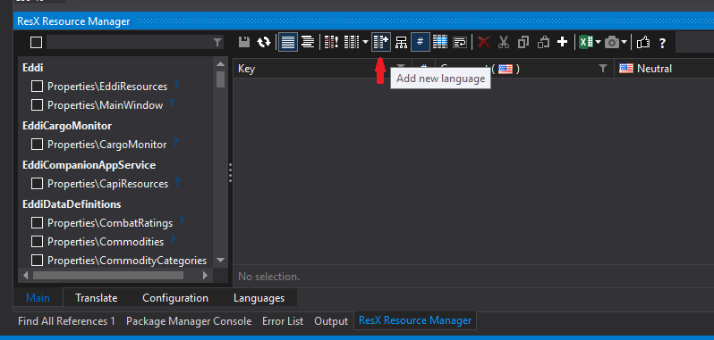

# Localization for devs

This is a bit of a brain dump. Some of this look a lot of figuring out, so it's useful to have it written down.

## Which text is localizable?

Text that appears in the UI or is spoken by TTS is localizable. Text in log messages is not, nor are variable names used by VoiceAttack and Cottle, and obviously neither is text sent over the network to web APIs.

I have verified in-game that ship names, such as "Cobra" and manufacturer names, such as "Lakon", are not localizable.

The initial pull request localized the phonetic pronunciations of the ICAO alphabet, including translating the numerals, but I don't think that is appropriate and have discarded it.

## Things we mustn't do any more

### Can't change the global culture setting

We used to do stuff like this:
```cs
// Use en-US everywhere to ensure that we don't use , rather than . for our separator
private static CultureInfo EN_US_CULTURE = new CultureInfo("en-US");
```
and 
```cs
// Set the culture for this thread to the installed culture, to allow better selection of TTS voices
Thread.CurrentThread.CurrentUICulture = new CultureInfo(CultureInfo.InstalledUICulture.Name);
```
This was never good practice, and now it will override the user's preferred UI culture, so we can't do that. Instead we need to specify `CultureInfo.InvariantCulture` at the point where the data gets formatted:
```cs
eddiInsuranceDecimal.Text = eddiConfiguration.Insurance.ToString(CultureInfo.InvariantCulture);
```
### Can't assume that items have a single name that never changes

In some cases we are looking up materials etc by their display name rather than EDName. This is obviously fragile when display names get localized. In code, properties must be clearly described (e.g. `localizedName` and `invariantName`). 

Pre-existing variable properties like `name` which are not clear, shall not be used in code. Instead, they shall be tagged with `[Obsolete()]` attribute tag. This will allow functionality to be preserved for Cottle scripts and VoiceAttack users while maintaining clear variable descriptions in the codebase.

```cs
[Obsolete("Please be explicit and use localizedName or invariantName")]
public string name => localizedName;
```

## Project preparation

Surprisingly, Visual Studio isn't much help here. Though the `csproj` file is accessible in Visual Studio, you must unload the project file and then right click to edit the project. You may prefer to close the solution and hand-edit the files, copy-pasting from an existing project.

If localizing resources using **UltimateResourceFallbackLocation.MainAssembly** (as described below), the `csproj` file MUST NOT have the following stanza added under the top-level `<Project>` tag, as this will cause the program to look for a satellite resource bearing the same name:

```xml
  <PropertyGroup>
    <UICulture>en</UICulture>
  </PropertyGroup>
```

Conversely, if localizing resources using **UltimateResourceFallbackLocation.Satellite** then the `csproj` file MUST include the above stanza.

Beware of the existing PropertyGroup tags: most of them are conditional on a particular build configuration or CPU platform which is not what we want.

The Properties\AssemblyInfo.cs file needs a `using System.Resources;` at the top and the following in the body (the comment isn't strictly necessary but it is part of MS's boilerplate):

```csharp

//In order to begin building localizable applications, set 
//<UICulture>CultureYouAreCodingWith</UICulture> in your .csproj file
//inside a <PropertyGroup>.  For example, if you are using US english
//in your source files, set the <UICulture> to en-US.  Then uncomment
//the NeutralResourceLanguage attribute below.  Update the "en-US" in
//the line below to match the UICulture setting in the project file.

[assembly: NeutralResourcesLanguage("en", UltimateResourceFallbackLocation.MainAssembly)]
```

This defines your neutral resource string table as "en" and indicates that the neutral resource is located in the main assembly resource file (e.g. MainWindow.resx) rather than in a satellite resource file (e.g. MainWindow.en-US.resx). 

## Resource editing

To add a resource, right-click the project's Properties folder, choose Add->New Item, then Resources file. Hit F2 to rename it, the name must be a legal C# class name. We'll use `Superpowers` for this example. The next step is important and easily forgotten: open the resource and change the access modifier from `Internal` to `Public`. Visual Studio will generate the code-behind file `Superpowers.Designer.cs` which gives a handy type-safe accessor for each key in the string table, such as `EddiDataDefinitions.Properties.Superpowers.Empire`. This lets us catch typos at compile time. It's also the reason why resource names and string table keys need to be legal C# names. Sometimes Studio has a senior moment and forgets to update the code-behind file, in which case right-click the resource and choose "Run Custom Tool".

Now we duplicate the resource (ctrl+c, ctrl+v, F2 to rename) for each supported satellite culture (at the time of writing these are fr and es). The culture specifier goes between the resource name and the `.resx` suffix, for example `Superpowers.fr.resx`. Studio is smart enough to recognize these as localisations and give them an empty code-behind file.

If you don't yet have a translation for a given key, omit that key entirely from the localized string table - the OS will fall back to the neutral resource string table. Don't put in a key with a blank value or you'll get blank text in the UI!

Note: Various tools exist to assist with managing resource files in Visual Studios. One that we have found useful so far is [ResXManager](https://github.com/tom-englert/ResXResourceManager/).

## XAML localization

I had lots of fun figuring this out. This will be easist to follow if you have `MainWindow.xaml` open. 

Pro tip: fix any C# errors before tackling the XAML. The XAML compiler looks at the compiled CLR, so won't see any changes to resources etc until C#-land is building happily.

Now, the trick is to create a static binding between the XAML and the code-behind resource accessors. We add the following property to the top-level `<Window>` tag:
```xml
        xmlns:resx="clr-namespace:Eddi.Properties"
```
The name `resx` is arbitrary, I could have called it anything. The right hand side will vary depending which project you are working in but will always be the fully qualified name of that project's `Properties` namespace.

To set up the binding, we state an item's `Text` or `Contents` property to be in the form `"{x:Static resx:MainWindow.version_hyperlink}"` where `resx` is the name I chose above, `MainWindow` is the resource name and `version_hyperlink` is the string key. We are thus binding to the C# accessor `Eddi.Properties.MainWindow.version_hyperlink`. Fortunately we get autocomplete for this.

These bindings only work for properties of items, so any free text in the XAML needs to be turned into `<Run>` or `<TextBlock>` items. Some examples:
```xml
<TextBlock DockPanel.Dock="Left" VerticalAlignment="Center" Text="{x:Static resx:MainWindow.EDDI_status_label}"/>

<Hyperlink Click="ChangeLog_Click">
    <Run Text="{x:Static resx:MainWindow.version_hyperlink}" />
</Hyperlink>
<Button x:Name="upgradeButton" VerticalAlignment="Center" DockPanel.Dock="Left" Visibility="Collapsed" Margin="10,0,10,0" Foreground="Orange" Click="upgradeClicked" Content="{x:Static resx:MainWindow.upgrade_button}"></Button>
```

## C# localization

If you know the key at compile time then the best way is to call the auto-generated accessor, like the `EddiDataDefinitions.Properties.Superpowers.Empire` mentioned above. If the key is not known until runtime then call the resource's GetString accessor with the key:
```csharp
string edName = "Empire";
string localizedName = EddiDataDefinitions.Properties.Superpowers.GetString(edName);
```
Be prepared to get `null` if the key is neither in the resource nor in the English fallback resource.

You can also specify a different CultureInfo:
```csharp
string invariantName = EddiDataDefinitions.Properties.Superpowers.GetString(edName, CultureInfo.InvariantCulture);

CultureInfo frenchCulture = new CultureInfo("fr");
string frenchName = EddiDataDefinitions.Properties.Superpowers.GetString(edName, frenchCulture);
```

## The `ResourceBasedLocalizedEDName` class

I've introduced a base class in `EddiDataDefinitions` called, catchily, `ResourceBasedLocalizedEDName<T>` to avoid having to repeat code a lot. The idea is that each string table uses the EDName, minus any illegal characters and any redundant prefix, as the key. When you subclass it you parameterize it with the subclass's type so that methods like `FromEDName()` get the correct type for their return value.

The base class implements a list of all known values, named `AllOfThem`,  plus the following properties:

- `edname`
- `basename`
- `invariantName`
- `localizedName`

and the following methods:

- `ToString()`
- `FromName()`
- `FromEDName()`

Have a look at `Government.cs` as it's a good example. The static constructor is where everything is set up. First the class's `resourceManager` property is set up. In this case we need to tell it to be case insensitive: Microsoft does document this as causing a small performance hit so if you can get away without doing that then please do.
```csharp
        static Government()
        {
            resourceManager = Properties.Governments.ResourceManager;
            resourceManager.IgnoreCase = true;
```
If you need to handle cases where the EDName is not recognized (e.g. whenever FD introduce new weapons, materials, etc.) then define the `missingEDNameHandler` too. This is a function that takes a string, the EDName, and returns an instance of the class in question:
```csharp
            missingEDNameHandler = (edname) => new Government(edname);
```
If you don't define the `missingEDNameHandler` then you will get `null` when you call `FromEDName()` with an unrecognized EDName.

Next we instantiate all the values that we know about:
```csharp
            None = new Government("$government_None;");
            var Anarchy = new Government("$government_Anarchy;");
            var Colony = new Government("$government_Colony;");
            var Communism = new Government("$government_Communism;");
            var Confederacy = new Government("$government_Confederacy;");
            var Cooperative = new Government("$government_Cooperative;");
            var Corporate = new Government("$government_Corporate;");
            var Democracy = new Government("$government_Democracy;");
            var Dictatorship = new Government("$government_Dictatorship;");
            var Feudal = new Government("$government_Feudal;");
            var Imperial = new Government("$government_Imperial;");
            var Patronage = new Government("$government_Patronage;");
            var Prison = new Government("$government_Prison;");
            var PrisonColony = new Government("$government_PrisonColony;");
            var Theocracy = new Government("$government_Theocracy;");
            var Workshop = new Government("$government_Workshop;");
            var Engineer = new Government("$government_engineer;");
        }
```
The base class will automatically add them all to the `AllOfThem` list.

In this example only the `None` value is needed by client code, so that is the only one I exposed:
```csharp
        public static readonly Government None;
```

The base class needs a public no-argument constructor, which it calls if `AllOfThem` is empty to cause the static constructor to run and populate it. As long as its `basename` is null or empty, the object returned by this constructor will be discarded and not added to `AllOfThem`.
```csharp
        // dummy used to ensure that the static constructor has run
        public Government() : this("")
        {}
```
Finally we get to the real constructor. We initialise the base class with first the EDName, then the basename, which is the EDName without any illegal characters and any redundant prefix, and is also the lookup key in the resource's string table:
```csharp
        private Government(string edname) : base(edname, edname.Replace("$government_", "").Replace(";", ""))
        {}
```
Phew. That was quite a bit to get through, but the advantages of having all the repeated code in the base class are definitely worth it.

## Cottle localization

In `EddiSpeechResponder.Properties.Resources` the key `default_personality_script_filename` names the default personality file to be loaded. It remains `eddi.json` for the English version and is `eddi.fr.json` for French, etc.

## User setttings

Most users will just go with the system language setting and EDDI will automatically pick the right localization if it is available, but some may want to override that and pick a different one, for example to show French on a computer that generally is set to English.

To that end I have added an application setting called `OverrideCulture` which is a string. If it is null or empty (the default) then there will be no override and the user's normal culture will be used. If it is set to a valid culture name such as "fr" then that culture will be used.

This is implemented in `App.xaml.cs` in the method `ApplyAnyOverrideCulture()`, because it needs to happen before any UI is loaded.

## Enumerating the installed localizations

The simplest way to do this is to iterate the top-level subdirectories on the installed app location and try to create a `CultureInfo` object from each of their names. If you succeed, add the `CultureInfo` to the list. If the name is invalid you'll get a `CultureNotFoundException`.

## Adding a new language

The simplest way to add a new language to EDDI is via [ResXManager](https://github.com/tom-englert/ResXResourceManager/). In ResXManager, before making any other changes for the new language, select the `Add new language` button in ResXManager.
